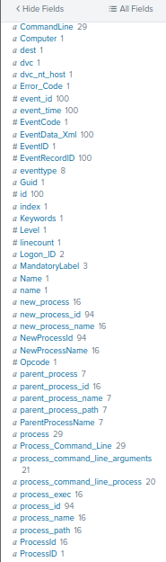
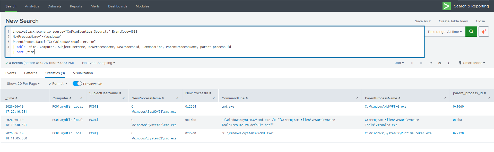
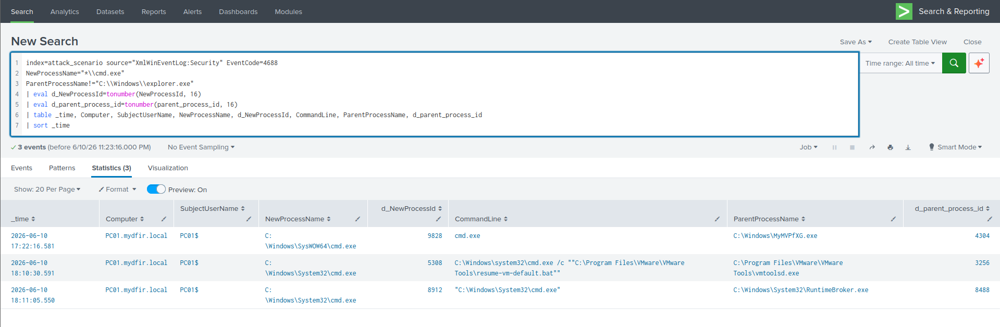
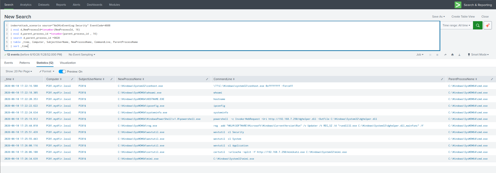

# Hunting CMD Execution (Security EID 4688 Only)

[← Back to Hunting Execution Artifacts](README.md)

## Scenario

Continuing the hunt into **Command and Scripting Interpreters (T1059.003)**, this time targeting `cmd.exe` specifically — and deliberately using **only Windows Security Event Logs (EID 4688)**, with no Sysmon at all.

I built this hunt this way on purpose. Real-world engagements frequently don't have Sysmon deployed, and being effective with native Windows logging alone is a distinct skill from being effective with a high-fidelity EDR-grade source. I wanted to prove I could reconstruct the same attacker timeline from Lesson "Hunting PowerShell Execution" using a strictly inferior data source.

**Index:** `attack_scenario` | **Time range:** All Time
**Log source:** `XmlWinEventLog:Security`, Event ID `4688`

**Hypothesis:** An attacker executed `cmd.exe` on this endpoint, spawned from a non-interactive parent process.

## What I Was Hunting For

- Non-interactive `cmd.exe` spawns (parent ≠ `explorer.exe`)
- Machine-account (`SYSTEM`) context execution
- Hex-encoded process IDs requiring conversion before correlation
- The full attacker command sequence, reconstructed via parent PID pivot
- A direct comparison of Security EID 4688 fidelity against Sysmon EID 1

## Step 1 — Learn the EID 4688 Field Schema First

Before hunting, I confirmed exactly what fields this log source actually provides — they're not the same names as Sysmon, and assuming otherwise wastes time on queries that silently return nothing.

```sql
index=attack_scenario source="XmlWinEventLog:Security" EventCode=4688
| head 100
```



| Concept | Sysmon EID 1 Field | Security EID 4688 Field |
|---|---|---|
| New process path | `Image` | `NewProcessName` |
| Parent process path | `ParentImage` | `ParentProcessName` |
| New process ID | `ProcessId` | `NewProcessId` (hex) |
| Parent process ID | `ParentProcessId` | `parent_process_id` (hex) |
| User account | `User` | `SubjectUserName` |
| Command line | `CommandLine` | `CommandLine` |
| Host | `ComputerName` | `Computer` |

The critical catch here: both `NewProcessId` and `parent_process_id` are logged in **hexadecimal**, not decimal. Every later pivot depends on converting these before they're usable.

## Step 2 — Hunt Non-Interactive cmd.exe Executions

```sql
index=attack_scenario source="XmlWinEventLog:Security" EventCode=4688
NewProcessName="*\\cmd.exe"
ParentProcessName!="C:\\Windows\\explorer.exe"
| table _time, Computer, SubjectUserName, NewProcessName, NewProcessId, CommandLine, ParentProcessName, parent_process_id
| sort _time
```



**Result:** A single event — one non-interactive `cmd.exe` spawn in the entire dataset. In a noisier production environment this might return hundreds of results; getting exactly one here meant either a quiet environment or a surgical attacker. Either way, one result still demands full scrutiny rather than a quick dismissal.

## Step 3 — Convert Hex PIDs to Decimal

```sql
index=attack_scenario source="XmlWinEventLog:Security" EventCode=4688
NewProcessName="*\\cmd.exe"
ParentProcessName!="C:\\Windows\\explorer.exe"
| eval NewProcessId=tonumber(NewProcessId, 16)
| eval parent_process_id=tonumber(parent_process_id, 16)
| table _time, Computer, SubjectUserName, NewProcessName, NewProcessId, CommandLine, ParentProcessName, parent_process_id
| sort _time
```



`tonumber(field, 16)` converts the hex string to a decimal integer. This step is non-optional: trying to pivot using the raw hex value `0x2664` against Sysmon's decimal `9828` returns zero results, even though they're the same process. Every cross-source PID correlation requires this conversion.

`eval` doesn't modify the underlying indexed data — it only transforms values within the current search pipeline's output.

## Step 4 — Analyze the Single Result

| Field | Value | Significance |
|---|---|---|
| `SubjectUserName` | `PC01$` | Machine account, not an interactive user — typical of malware running as a service |
| `NewProcessName` | `C:\Windows\SysWOW64\cmd.exe` | 32-bit cmd on a 64-bit OS — consistent with the 32-bit payload chain identified in the PowerShell hunt |
| `NewProcessId` | `9828` (converted) | The cmd.exe process to pivot off |
| `ParentProcessName` | `C:\Windows\MyMVPfXG.exe` | The same PSExec service binary identified previously |
| `CommandLine` | `cmd.exe` (no arguments) | Interactive shell spawned by the service binary |
| `parent_process_id` | `4304` (converted) | PID of the randomized parent binary |

A `SubjectUserName` ending in `$` is a machine account — a computer object in Active Directory, not a human user. This indicates execution under `NT AUTHORITY\SYSTEM` or similarly privileged context, which is exactly how malware running as a Windows service presents in this log.

## Step 5 — Enumerate Children via Parent PID Pivot

```sql
index=attack_scenario source="XmlWinEventLog:Security" EventCode=4688
| eval d_NewProcessId=tonumber(NewProcessId, 16)
| eval d_parent_process_id=tonumber(parent_process_id, 16)
| search d_parent_process_id=9828
| table _time, Computer, SubjectUserName, NewProcessName, CommandLine, ParentProcessName
| sort _time
```



**Why `eval` must run before `search` here:** Splunk indexes the raw hex values. If `parent_process_id=9828` is searched before the `eval` runs, Splunk looks for the literal string `9828` against hex-formatted data and returns nothing. The conversion has to happen first in the pipeline, and the filter has to come after it.

## Step 6 — Read the Reconstructed Attack Timeline

Sorted chronologically, the children of PID 9828 reconstruct the full attacker session:
whoami.exe

hostname.exe

ipconfig.exe

systeminfo.exe

powershell.exe  →  Invoke-WebRequest → dghelper.dll → C:\Windows\System32

reg.exe         →  HKLM...\Run → rundll32 dghelper.dll,mainfunc

wevtutil.exe    →  cl Security

wevtutil.exe    →  cl System

wevtutil.exe    →  cl Application

certutil.exe    →  download mimi.exe

mimi.exe        →  privilege::debug → lsadump::sam → lsadump::secrets

This is identical to what Sysmon EID 1 returned in the PowerShell hunt — confirming that Security EID 4688, with command-line auditing enabled, is a fully viable fallback for reconstructing attacker activity when Sysmon isn't available.

## Key Findings

| Finding | Value |
|---|---|
| Non-interactive `cmd.exe` spawns | 1 — `SysWOW64\cmd.exe`, SYSTEM context |
| Parent process | `MyMVPfXG.exe`, PE32 binary in `C:\Windows\` |
| Machine account execution | `PC01$` — not an interactive user |
| Full attacker command chain | Reconstructed via PID `9828` pivot |
| Hex PID conversion required | `tonumber(field, 16)` before any correlation |

## ATT&CK Mapping

| Tactic | Technique | ID |
|---|---|---|
| Execution | Command and Scripting Interpreter: Windows Command Shell | T1059.003 |
| Execution | System Services: Service Execution | T1569.002 |
| Defense Evasion | Masquerading: Match Legitimate Name or Location | T1036.005 |
| Lateral Movement | Remote Services: SMB/Windows Admin Shares | T1021.002 |

## Sysmon EID 1 vs Security EID 4688 — Field Comparison

| Capability | Sysmon EID 1 | Security EID 4688 |
|---|---|---|
| Process path | `Image` | `NewProcessName` |
| Parent process path | `ParentImage` | `ParentProcessName` |
| Command line | Yes, by default | Only if GPO/registry configured |
| Process GUID | Yes — unique, never reused | No — PID only, reusable |
| Hash values | Yes — MD5, SHA256, IMPHASH | No |
| PID format | Decimal | Hexadecimal — must convert |
| Network connections | EID 3 (same agent) | Requires a separate log source |
| File creations | EID 11 (same agent) | Requires a separate log source |
| Registry changes | EID 13 (same agent) | EID 4657, if auditing enabled |
| Deployment requirement | Additional agent install | Native — GPO configuration only |

If I had to choose a single process telemetry source, Sysmon wins decisively on fidelity — GUIDs, hashes, and built-in coverage of network/file/registry events in the same agent. But this hunt confirmed that Security EID 4688 with command-line auditing enabled is not a weak fallback; it reconstructed the identical attacker timeline.

## Detection Opportunities

- `cmd.exe` spawning from any process whose name matches a randomized alphanumeric pattern directly under `C:\Windows\`
- `SubjectUserName` ending in `$` where `NewProcessName` is a shell interpreter
- `SysWOW64\cmd.exe` on 64-bit hosts outside known 32-bit application contexts
- Empty `CommandLine` field on EID 4688 events — a visibility gap indicating command-line auditing isn't enabled, flag this during any engagement scoping

## What I Took Away From This Hunt

- **Knowing the field name differences between log sources cold is non-negotiable.** I wasted zero time here because I checked the schema before writing a single filter — wrong field names against the right data return the same empty result as right field names against missing data, and it's easy to misread one as the other.
- **Hex PID conversion is a recurring requirement I'll hit constantly with native Windows logs.** `tonumber(field, 16)` belongs in muscle memory for anyone correlating Security logs against Sysmon, EDR output, Task Manager, or memory images.
- **Eval-then-search ordering matters and is a real way to silently break a query.** I deliberately built Step 5 to show this — searching against a raw hex field before converting it returns confidently wrong results (zero matches, which looks like "nothing here" rather than "wrong order").
- **I now have direct, hands-on proof that Sysmon isn't a hard requirement for effective process-tree reconstruction.** That matters going into any engagement where the client says "we don't have Sysmon" — I know exactly what I lose (GUIDs, hashes, same-agent network/file/registry coverage) and what I still have.

---

**Next:** [Hunting Process Trees →](hunting-process-trees.md)
