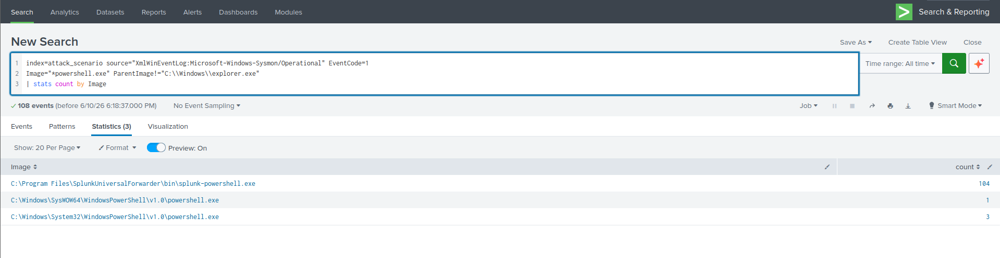
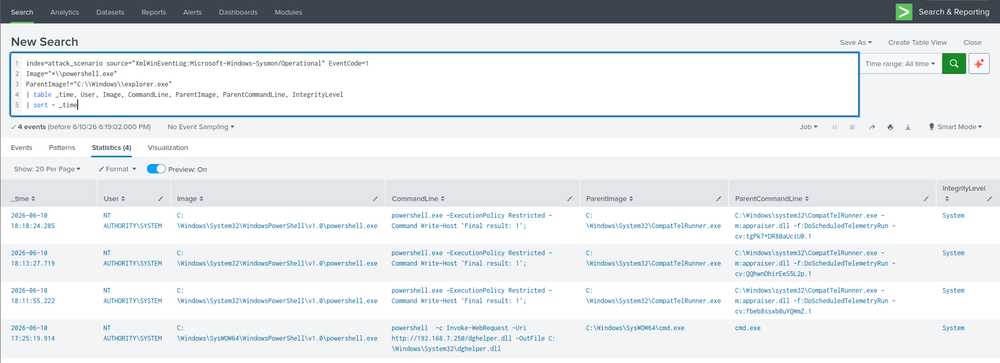
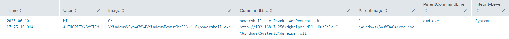
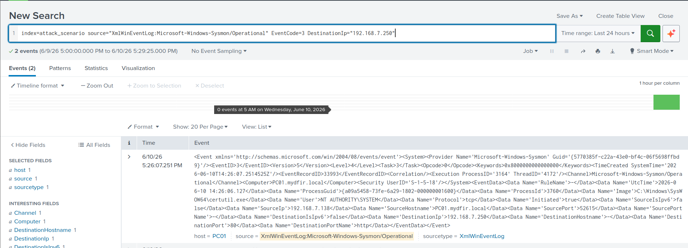
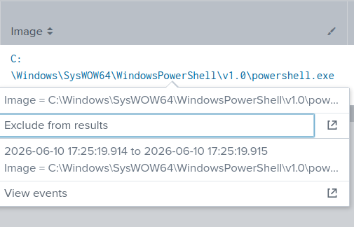
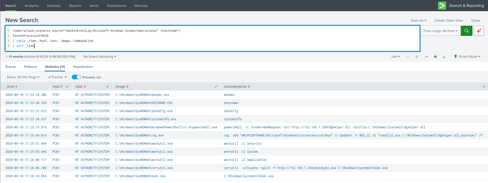
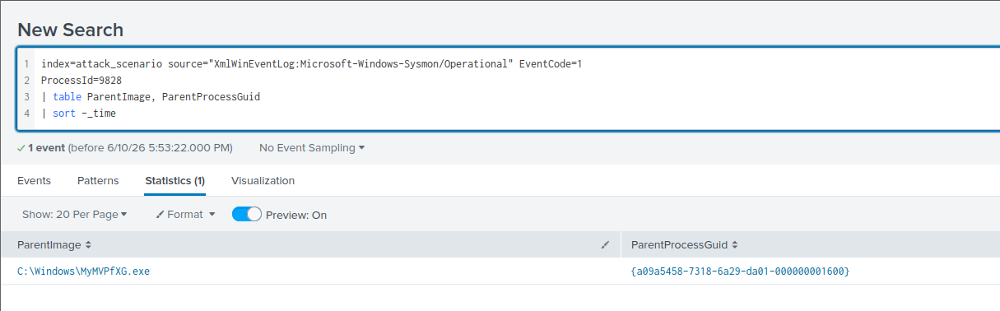
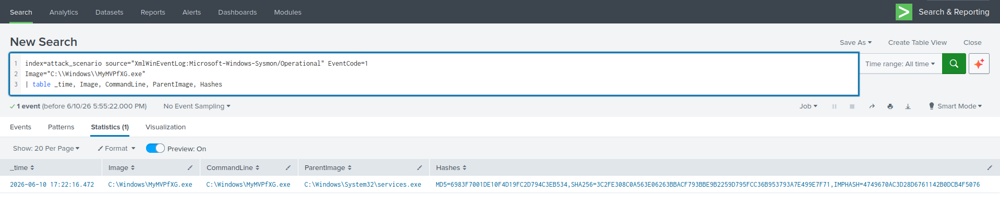
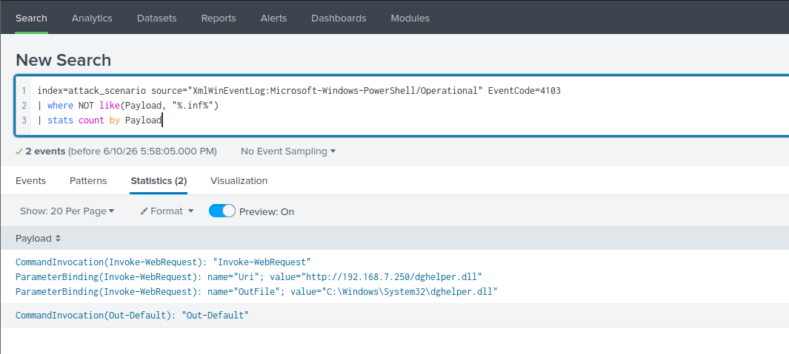
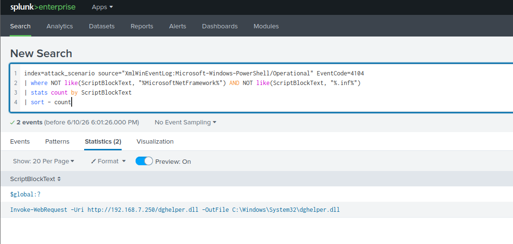

# Hunting PowerShell Execution

[← Back to Hunting Execution Artifacts](README.md)

## Scenario

Dropped into the `attack_scenario` index with no prior knowledge of what happened on this host. Hunting from scratch using a structured, hypothesis-driven approach.

**Hypothesis:** An attacker executed PowerShell on this compromised Windows endpoint.

**Index:** `attack_scenario` | **Time range:** All Time
**Primary source:** `XmlWinEventLog:Microsoft-Windows-Sysmon/Operational`, Event ID `1`

## What I Was Hunting For

- Non-interactive `powershell.exe` spawns (parent ≠ `explorer.exe`)
- Suspicious command-line arguments — downloads, encoded commands, LOLBin abuse
- 32-bit PowerShell execution (`SysWOW64`) on a 64-bit host
- PowerShell-initiated network connections to external hosts
- File drops resulting from PowerShell execution
- The parent process that spawned the suspicious PowerShell session
- The full process tree rooted at the attacker's foothold process

## Step 1 — Confirm Available Log Sources

Before writing any hypothesis-specific query, I confirmed what telemetry actually existed in the index rather than assuming.

```sql
| metadata type=sources index=attack_scenario
```

Confirmed presence of:
- `XmlWinEventLog:Microsoft-Windows-Sysmon/Operational` — Sysmon
- `XmlWinEventLog:Security` — Windows Security Log
- `XmlWinEventLog:Microsoft-Windows-PowerShell/Operational` — PowerShell logging
- `XmlWinEventLog:System` — System log
- `XmlWinEventLog:Microsoft-Windows-Windows Defender/Operational` — Defender

Skipping this step is a common way hunts fail silently — a query against a log source that was never collected returns zero results, which can be misread as "nothing happened" rather than "I'm not looking in the right place."

## Step 2 — Broad PowerShell Process Creation Hunt

```sql
index=attack_scenario source="XmlWinEventLog:Microsoft-Windows-Sysmon/Operational" EventCode=1
Image="*powershell.exe" ParentImage!="C:\\Windows\\explorer.exe"
| stats count by Image
```



I aggregated on `Image` before building a full table, specifically because I was using a prefix wildcard and wanted to see exactly what matched before committing to a detailed view — there's almost always a noise source (in this case, the Splunk Universal Forwarder's own PowerShell helper process) that needs to be filtered before the real signal is visible.

**What I found:**
- 3 events from `System32\powershell.exe`, spawned by `CompatTelRunner.exe`
- 1 event from `SysWOW64\powershell.exe` — the 32-bit variant on a 64-bit host, immediately the more interesting lead

## Step 3 — Rebuild as a Full Investigation Table

```sql
index=attack_scenario source="XmlWinEventLog:Microsoft-Windows-Sysmon/Operational" EventCode=1
Image="*\\powershell.exe"
ParentImage!="C:\\Windows\\explorer.exe"
| table _time, User, Image, CommandLine, ParentImage, ParentCommandLine, IntegrityLevel
| sort - _time
```



| Field | What It Tells You |
|---|---|
| `Image` | Full path of the PowerShell binary — 32 vs 64-bit |
| `CommandLine` | What was actually executed |
| `ParentImage` | What spawned PowerShell — the key pivot field |
| `IntegrityLevel` | `Medium` = user, `High` = admin, `System` = SYSTEM |
| `User` | Account context |

## Step 4 — Triage the Benign Results First

Before chasing the interesting lead, I ruled out the three `System32` events spawned by `CompatTelRunner.exe`:

1. Confirmed the path: `C:\Windows\System32\CompatTelRunner.exe`
2. Checked process reputation via **EchoTrail**: ~90% host prevalence → legitimate Microsoft compatibility telemetry process
3. Confirmed `IntegrityLevel: System` — expected for a scheduled telemetry task
4. Noted `ExecutionPolicy Restricted` in the command line, which limits script execution risk further


**Decision:** Documented as known-good baseline noise, deprioritized, moved on. Skipping this triage step and chasing every lead with equal urgency is how analysts burn time on intrusions that aren't there.

## Step 5 — Deep Dive on the SysWOW64 Event

Expanding the single anomalous row revealed:



| Indicator | Why It's Alarming |
|---|---|
| `SysWOW64` path | 32-bit binary on a 64-bit OS — unusual outside specific compatibility scenarios |
| Parent: `SysWOW64\cmd.exe` | Entire chain is 32-bit, suggesting a 32-bit payload further up the tree |
| `Invoke-WebRequest` in command line | Active outbound content retrieval |
| Destination: `C:\Windows\System32\dghelper.dll` | Dropping a payload into a high-density system directory to blend in |
| `IntegrityLevel: System` | Attacker holds SYSTEM-level privileges |

No single one of these is conclusive on its own. Stacked together, they're a strong signal.

## Step 6 — Pivot on the Filename

```sql
index=attack_scenario "dghelper.dll"
```

This single keyword search is how a confirmed artifact becomes a scoping tool — it returns every event across every log source that references the file, immediately answering "where else does this show up" before I move on.

## Step 7 — Pivot on the C2 IP Address

```sql
index=attack_scenario source="XmlWinEventLog:Microsoft-Windows-Sysmon/Operational" EventCode=3
DestinationIp=192.168.7.250
```



This confirmed an outbound connection over port 80 (unencrypted HTTP) from the PowerShell process, and gave me the `ProcessGuid` — Sysmon's unique process identifier — which links this network event directly back to the process creation event from Step 5 without ambiguity.

## Step 8 — Walk Up the Process Tree

**8a — Extract the parent PID from the malicious event:**

Opening the raw event and locating `ParentProcessId`: **`9828`**



**8b — Enumerate every child of that parent:**

```sql
index=attack_scenario source="XmlWinEventLog:Microsoft-Windows-Sysmon/Operational" EventCode=1
ParentProcessId=9828
| table _time, host, User, Image, CommandLine
| sort _time
```



This single pivot reconstructed the entire attacker session in chronological order — discovery commands, the PowerShell download, registry persistence, log clearing, and credential harvesting all fell out of one query.

## Step 9 — Walk Further Up: What Spawned the Shell

```sql
index=attack_scenario source="XmlWinEventLog:Microsoft-Windows-Sysmon/Operational" EventCode=1
ProcessId=9828
| table ParentImage, ParentProcessGuid
| sort -_time
```



This revealed `MyMVPfXG.exe` under `C:\Windows\` as the parent — the randomly-named PSExec service binary from the lateral movement phase.

## Step 10 — Hash the Binary and Check VirusTotal

```sql
index=attack_scenario source="XmlWinEventLog:Microsoft-Windows-Sysmon/Operational" EventCode=1
Image="C:\\Windows\\MyMVPfXG.exe"
| table _time, Image, CommandLine, ParentImage, Hashes
```



VirusTotal flagged the hash across multiple AV vendors as a remote execution tool, and confirmed it as a PE32 (32-bit) executable — consistent with every other 32-bit artifact in this chain.

## Step 11 — Confirm via PowerShell Operational Logs

As a supplemental, independent confirmation source:

```sql
index=attack_scenario source="XmlWinEventLog:Microsoft-Windows-PowerShell/Operational" EventCode=4103
| where NOT like(Payload, "%.inf%")
| stats count by Payload
```

```sql
index=attack_scenario source="XmlWinEventLog:Microsoft-Windows-PowerShell/Operational" EventCode=4104
| where NOT like(ScriptBlockText, "%MicrosoftNetFramework%") AND NOT like(ScriptBlockText, "%.inf%")
| stats count by ScriptBlockText
| sort - count
```




EID 4103 (module logging) gave me the exact `Invoke-WebRequest` parameter bindings — URI and output path — in plain text, with no need to deobfuscate anything. EID 4104 (script block logging) confirmed the same content at the full script-block level. Filtering out `.inf` references removed legitimate Windows setup/driver script noise that otherwise dominates this event ID.

## Full Process Tree Reconstructed
