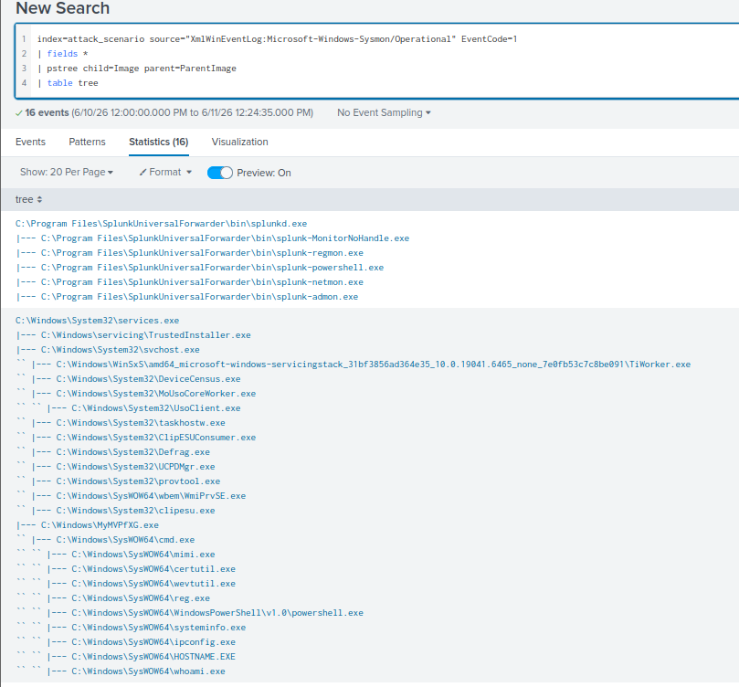
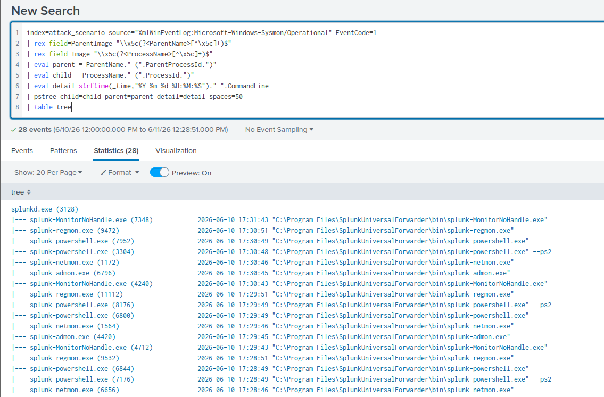
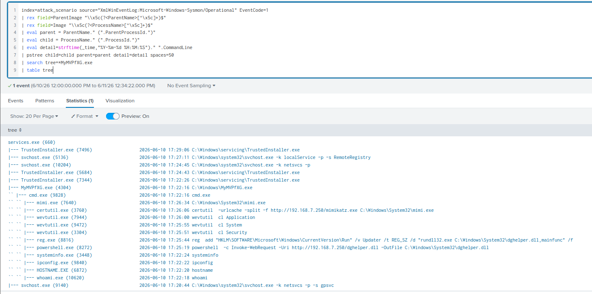

# Hunting Process Trees (PSTree for Splunk)

[← Back to Hunting Execution Artifacts](README.md)

## Scenario

The previous two hunts reconstructed the attacker's process tree manually — finding a suspicious process, pulling its parent PID, enumerating its children, and walking up or down the chain one query at a time. This lesson introduces **PSTree for Splunk**, a free Splunkbase add-on that collapses that entire manual process into a single, visually readable query.

**Index:** `attack_scenario` | **Time range:** All Time
**Log source:** `XmlWinEventLog:Microsoft-Windows-Sysmon/Operational`, Event ID `1`

**Goal:** Reconstruct the full attacker process tree rooted at `MyMVPfXG.exe` in a single readable visualization, confirming everything found across the previous two hunts.

## What is PSTree for Splunk

A custom search command (`psTree`) that takes process creation events and reconstructs parent-child relationships into a visual tree — the same mental model as `pstree` on Linux or Volatility's `pstree` plugin in memory forensics.

**Installation:** Downloaded the zip archive from Splunkbase → Splunk UI → Apps → Manage Apps → Upload App.

**How it works:** Requires two fields representing the child process and its parent, then walks the relationships recursively and renders an indented tree with visual connectors.

**A real limitation worth noting:** This tool is a zoom-in instrument, not a zoom-out one. It works well scoped to a single host and a narrow time window. Run it across an entire enterprise index spanning months of data and the output becomes an unreadable wall of text. I only reached for it once I already had a specific suspicious host and binary in mind.

## Step 1 — Basic PSTree

```sql
index=attack_scenario source="XmlWinEventLog:Microsoft-Windows-Sysmon/Operational" EventCode=1
| fields *
| psTree child=Image parent=ParentImage
| table Tree
```



`| fields *` pipes every available field into the pipeline before `psTree` runs — required because the command needs access to whatever fields it's told to use for the relationship walk.

`psTree child=Image parent=ParentImage` tells the command which field represents the process and which represents its parent.

This immediately surfaced the structure: `services.exe` near the root, `MyMVPfXG.exe` spawned under it, `cmd.exe` (SysWOW64) under that, and every attacker command underneath. The limitation of this basic form is real, though — no timestamps, no PIDs, no command lines. You can see the shape of the tree but not the content.

## Step 2 — Enriched PSTree (Timestamps, PIDs, Command Lines Inline)

```sql
index=attack_scenario source="XmlWinEventLog:Microsoft-Windows-Sysmon/Operational" EventCode=1
| rex field=ParentImage "\\x5c(?<ParentName>[^\x5c]+)$"
| rex field=Image "\\x5c(?<ProcessName>[^\x5c]+)$"
| eval parent = ParentName." (".ParentProcessId.")"
| eval child = ProcessName." (".ProcessId.")"
| eval detail=strftime(_time,"%Y-%m-%d %H:%M:%S")." ".CommandLine
| pstree child=child parent=parent detail=detail spaces=50
| table tree
```



| Line | Purpose |
|---|---|
| `rex field=ParentImage "\\x5c(?<ParentName>...)"` | Strips the directory path, leaving just the parent binary filename |
| `rex field=Image "\\x5c(?<ProcessName>...)"` | Same extraction for the child process |
| `eval parent = ParentName." (".ParentProcessId.")"` | Builds a readable label: `cmd.exe (9828)` |
| `eval child = ProcessName." (".ProcessId.")"` | Same pattern for the child node |
| `eval detail=strftime(...)." ".CommandLine` | Attaches a formatted timestamp + full command line to each node |
| `pstree child=child parent=parent detail=detail spaces=50` | Renders the enriched tree, 50-character spacing for the detail column |

`\x5c` is the hex escape for a backslash — used here specifically to avoid escaping headaches inside the `rex` pattern itself. The PID-in-parentheses pattern matters in practice: if this environment had two instances of `svchost.exe` running simultaneously, the basic tree from Step 1 couldn't tell them apart, but `svchost.exe (1234)` and `svchost.exe (5678)` render as distinguishable nodes.

## Step 3 — Filter to the Specific Attack Tree

```sql
index=attack_scenario source="XmlWinEventLog:Microsoft-Windows-Sysmon/Operational" EventCode=1
| rex field=ParentImage "\\x5c(?<ParentName>[^\x5c]+)$"
| rex field=Image "\\x5c(?<ProcessName>[^\x5c]+)$"
| eval parent = ParentName." (".ParentProcessId.")"
| eval child = ProcessName." (".ProcessId.")"
| eval detail=strftime(_time,"%Y-%m-%d %H:%M:%S")." ".CommandLine
| pstree child=child parent=parent detail=detail spaces=50
| search tree="*MyMVPfXG*"
| table tree
```



`| search tree="*MyMVPfXG*"` filters the already-rendered tree output down to only the chain containing the known malicious binary — every legitimate system process tree gets dropped from the results.

**The ordering here matters and I deliberately tested it both ways.** `psTree` builds its output by recursively walking parent-child relationships. Filtering *before* `psTree` runs severs that chain — parent nodes that don't happen to match the keyword get excluded from the search results entirely, and the tree either renders incomplete or doesn't render at all. Filtering *after* `psTree` has already built the full tree and is now just operating on the final rendered string is the correct approach.

## What This Returns

One complete process tree — the attacker's entire session from initial service binary execution through credential harvesting — with timestamps and full command lines rendered inline at every node. The `detail` column reads top to bottom as a chronological narrative without needing a separate time-sorted table alongside it.

## Key Findings

| Finding | Detail |
|---|---|
| Root of attacker activity | `services.exe` → `MyMVPfXG.exe` — PSExec service binary confirmed |
| Shell context | `SysWOW64\cmd.exe` (PID `9828`) — 32-bit chain consistent with PE32 payload |
| Privilege level | `SYSTEM` throughout entire tree |
| Full attacker sequence | Enumeration → tool transfer → persistence → log clearing → credential dumping |
| Visualization method | Single enriched PSTree query replaced 4+ manual PID pivot queries from the previous two hunts |
| Inline context | Timestamps and full command lines visible per node without additional pivoting |

## ATT&CK Mapping

| Tactic | Technique | ID |
|---|---|---|
| Execution | System Services: Service Execution | T1569.002 |
| Execution | Command and Scripting Interpreter: Windows Command Shell | T1059.003 |
| Lateral Movement | Remote Services: SMB/Windows Admin Shares | T1021.002 |
| Discovery | System Information Discovery | T1082 |
| Command & Control | Ingress Tool Transfer | T1105 |
| Persistence | Boot/Logon Autostart: Registry Run Keys | T1547.001 |
| Defense Evasion | Indicator Removal: Clear Windows Event Logs | T1070.001 |
| Credential Access | OS Credential Dumping: SAM | T1003.002 |

## Detection Opportunities

- Any process tree where `services.exe` spawns a randomized alphanumeric binary directly under `C:\Windows\`
- Process trees where the `detail` column shows download cmdlets (`Invoke-WebRequest`, `certutil -urlcache`) sitting under a service binary in the parent chain
- `cmd.exe` or `powershell.exe` appearing as a direct child of any non-standard service binary

## What I Took Away From This Hunt

- **A visualization tool is only as valuable as your understanding of what it's automating.** I deliberately did the manual PID-pivot reconstruction first (across both the PowerShell and CMD hunts) before reaching for PSTree, specifically so I'd understand what the tool was doing under the hood — not just trust its output blindly. PSTree won't be installed in every environment I work in; the manual technique always will be available.
- **Filter-after, not filter-before, is a subtle but real failure mode with recursive tree-building commands.** This is the kind of detail that's easy to get backwards under time pressure during an actual incident, and I wanted it documented clearly for my own future reference.
- **This tool's real value is IR triage speed, not routine hunting.** Once I have a specific suspect host and a narrow time window, this collapses what would be five or six sequential queries into one. Outside of that scoped context, it's the wrong tool.

---

**Section complete.** [← Back to Hunting Execution Artifacts](README.md)
