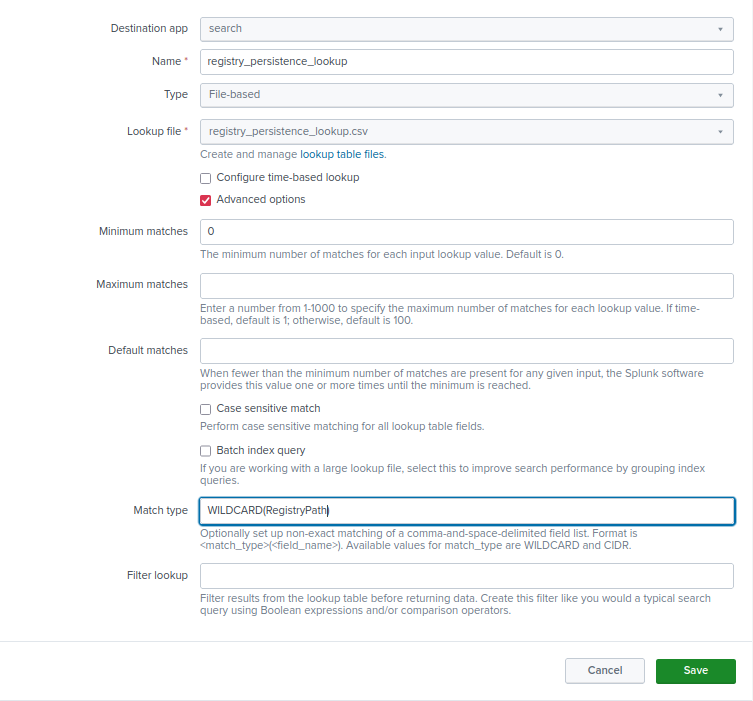
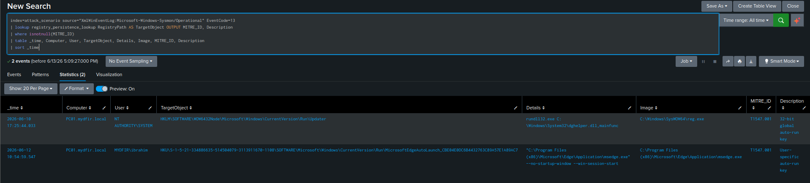
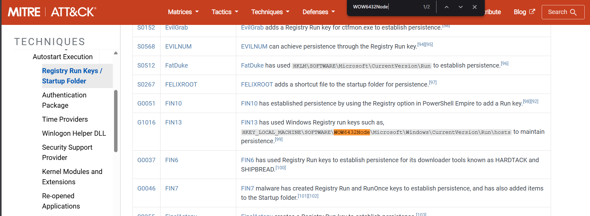
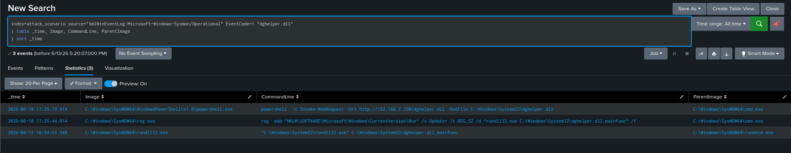
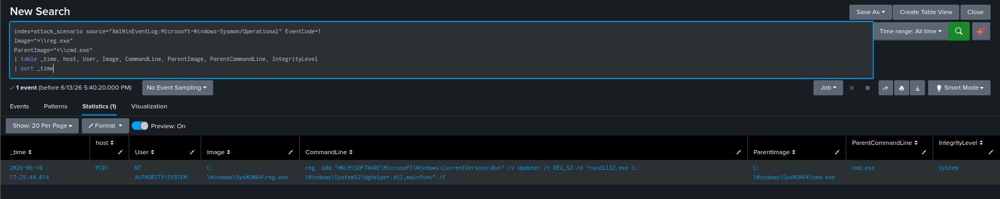
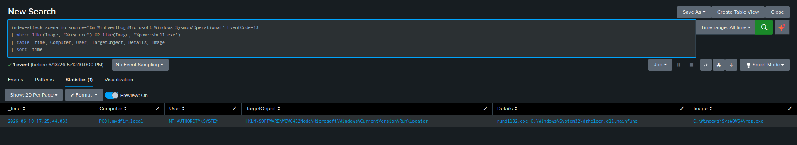

# Hunting Persistence: Lookup Tables

[← Back to Hunting Persistence](README.md)

## Scenario

The previous hunt scoped Run key detection to four hardcoded standard paths and missed the attacker's actual persistence entry, because their 32-bit tooling caused Windows to silently redirect the registry write into a `WOW6432Node` path my wildcard never covered. This lesson fixes that properly — not by patching one wildcard, but by building a **Splunk lookup table** that scales to cover known persistence paths broadly, including WOW64-redirected equivalents, without needing a query rewrite every time a new path gets documented.

I also use this as an opportunity to hunt the same technique three additional independent ways — pivoting on `reg.exe` process creation, filtering EID 13 by writing process, and confirming DLL execution — to demonstrate that no single detection angle should be treated as sufficient on its own.

**Index:** `attack_scenario` | **Time range:** All Time
**Primary source:** `XmlWinEventLog:Microsoft-Windows-Sysmon/Operational`, Event IDs `13`, `1`
**Lookup file:** `registry_persistence_lookup.csv`

**Hypothesis:** An attacker established persistence via a registry Run key — possibly in a non-standard or WOW64-redirected path that hardcoded queries would miss.

## Why a Lookup Table Instead of a Bigger Wildcard

I could have just added `Wow6432Node` to my Step 2 wildcard from the previous hunt and called it fixed. That would have caught this one specific gap, but it doesn't scale — every time a new persistence technique gets documented (Winlogon helper DLLs, AppInit_DLLs, shell extension hijacking, and dozens more under T1547 alone), I'd be back in the SPL editing a wildcard list by hand.

A lookup table solves this differently: the registry path intelligence lives in a CSV file, not in the search query itself. Adding coverage for a new technique means adding a row to the CSV — the SPL never changes. This is also how I'd want this to work on a real team: the detection logic is centralized and reviewable independent of whoever's writing the hunt query that day.

## Windows Registry Redirection (WOW64) — The Mechanism Behind the Gap

On 64-bit Windows, a compatibility subsystem called WOW64 (Windows on Windows 64-bit) lets 32-bit applications run. Part of that compatibility layer silently redirects registry operations:

| Process Architecture | Writes to | Actually lands in |
|---|---|---|
| 64-bit | `HKLM\SOFTWARE\Microsoft\Windows\CurrentVersion\Run` | Same path |
| 32-bit | `HKLM\SOFTWARE\Microsoft\Windows\CurrentVersion\Run` | `HKLM\SOFTWARE\Wow6432Node\Microsoft\Windows\CurrentVersion\Run` |

The redirect is completely transparent to the application — the 32-bit process making the write has no idea it happened. For a threat hunter, this means: if an attacker is using 32-bit tools (confirmed here by `SysWOW64\reg.exe`), their registry writes land in `Wow6432Node` paths that a standard Run-key query won't cover.

**The tell in Sysmon:** if `Image` shows a `SysWOW64` path, expect WOW64 redirection in the resulting `TargetObject`.

## Setting Up the Lookup Table in Splunk

### Step 1 — Upload the CSV

`Settings → Lookups → Lookup Table Files → New Lookup Table File`

- Uploaded: `registryPersistenceLookup.csv`
- Destination filename: `registry_persistence_lookup.csv`

**CSV structure:**

| RegistryPath | MITRE_ID | description |
|---|---|---|
| `*\CurrentVersion\Run\*` | T1547.001 | Standard Run key persistence |
| `*\CurrentVersion\RunOnce\*` | T1547.001 | RunOnce key persistence |
| `*\Wow6432Node\*\CurrentVersion\Run\*` | T1547.001 | 32-bit redirected Run key |
| `*\Winlogon\*` | T1547.004 | Winlogon persistence |
| `*\AppInit_DLLs*` | T1546.010 | AppInit DLL persistence |

Wildcards in `RegistryPath` handle dynamic segments like per-user SIDs (`HKU\S-1-5-21-...\Software\...`).

### Step 2 — Create the Lookup Definition

`Settings → Lookups → Lookup Definitions → New Lookup Definition`



| Setting | Value |
|---|---|
| Name | `registry_persistence_lookup` |
| Destination app | `search` |
| Type | File-based |
| Lookup file | `registry_persistence_lookup.csv` |
| Case sensitive match | Unchecked |
| Match type | `WILDCARD(RegistryPath)` |

**Why case-insensitive:** Sysmon and different Windows versions can log registry paths with inconsistent capitalization. Leaving case sensitivity on risks missed matches for no good reason.

**Why `WILDCARD(RegistryPath)` specifically:** This setting tells Splunk to treat the `*` characters in the CSV's `RegistryPath` column as actual wildcards during matching, not literal asterisk characters. Without it, Splunk looks for a registry key literally named `*\CurrentVersion\Run\*` — which obviously never matches anything.

## Step 3 — Run the Lookup-Enriched Hunt

```sql
index=attack_scenario source="XmlWinEventLog:Microsoft-Windows-Sysmon/Operational" EventCode=13
| lookup registry_persistence_lookup RegistryPath AS TargetObject OUTPUT MITRE_ID, Description
| where isnotnull(MITRE_ID)
| table _time, Computer, User, TargetObject, Details, Image, MITRE_ID, Description
| sort _time
```



| Clause | What It Does |
|---|---|
| `lookup registry_persistence_lookup` | References the lookup by name |
| `RegistryPath AS TargetObject` | Maps the CSV's `RegistryPath` column against the Sysmon `TargetObject` field — this is where matching happens |
| `OUTPUT MITRE_ID, Description` | Appends those columns from the CSV onto any matching event |
| `where isnotnull(MITRE_ID)` | Drops every event that didn't match anything in the lookup — turning the lookup from pure enrichment into an active filter |

## Step 4 — The Gap, Closed
TargetObject:  HKLM\SOFTWARE\Wow6432Node\Microsoft\Windows\CurrentVersion\Run\Updater

Details:       rundll32.exe C:\Windows\System32\dghelper.dll,mainfunc

Image:         C:\Windows\SysWOW64\reg.exe

User:          SYSTEM

MITRE_ID:      T1547.001

description:   32-bit global auto-run key



This is exactly the entry the previous hunt missed. The attacker's full chain is 32-bit end to end — `MyMVPfXG.exe` (PE32) → `SysWOW64\cmd.exe` → `SysWOW64\reg.exe`. When that 32-bit `reg.exe` wrote to `HKLM\...\Run`, WOW64 silently redirected the write to `Wow6432Node`. The standard, native Run key path I queried in the previous hunt was empty the entire time — the persistence only ever existed in the redirected location.

I confirmed this isn't a theoretical edge case by checking MITRE's documented procedures for T1547.001 — both **FIN13** and **MustangPanda** are documented using this exact `Wow6432Node` path for persistence in real intrusions.

## Step 5 — Confirm Persistence Payload Execution

```sql
index=attack_scenario source="XmlWinEventLog:Microsoft-Windows-Sysmon/Operational" EventCode=1
"dghelper.dll"
| table _time, Image, CommandLine, ParentImage
| sort _time
```



Three events returned: the original PowerShell download, the `reg add` command that planted the persistence, and — critically — an actual execution event. `rundll32.exe` running from `SysWOW64`, invoking `dghelper.dll,mainfunc`, with `ParentImage` showing `C:\Windows\SysWOW64\runonce.exe`.

This confirms the implant actually fired — it's not just sitting dormant in the registry. The parent being `runonce.exe` rather than the more commonly expected `userinit.exe` → `explorer.exe` logon chain is itself informative: it reflects that this particular execution path went through the WOW64 subsystem's own 32-bit startup item handler rather than the native 64-bit boot sequence. A real-world payload sitting in a native 64-bit key would more typically show `userinit.exe` or `explorer.exe` as the parent at a standard user logon. Detection logic needs to account for both paths — assuming only one expected parent process risks a blind spot for anything routed through the WOW64 redirection layer.

## Step 6 — Alternative Angle: reg.exe Spawned by cmd.exe

```sql
index=attack_scenario source="XmlWinEventLog:Microsoft-Windows-Sysmon/Operational" EventCode=1
Image="*\\reg.exe"
ParentImage="*\\cmd.exe"
| table _time, host, User, Image, CommandLine, ParentImage, ParentCommandLine, IntegrityLevel
| sort _time
```



This hunts the exact same technique from a completely different telemetry angle — process creation instead of registry modification. The `CommandLine` here shows the attacker typed the standard native path, while the EID 13 `TargetObject` from Step 4 showed where it actually landed. That difference is the core insight of this entire investigation: process creation logs show attacker **intent**, registry modification logs show actual **effect**, and they can diverge in ways that matter for detection coverage.

## Step 7 — Alternative Angle: EID 13 Filtered by Writing Process

```sql
index=attack_scenario source="XmlWinEventLog:Microsoft-Windows-Sysmon/Operational" EventCode=13
| where like(Image, "%reg.exe") OR like(Image, "%powershell.exe")
| table _time, Computer, User, TargetObject, Details, Image
| sort _time
```



This flips the filter logic again — instead of asking "what registry path was touched," I asked "who touched the registry." Legitimate software rarely uses `reg.exe` or PowerShell directly to write Run keys outside of install/uninstall routines. This angle catches persistence techniques even in registry paths that haven't made it into my lookup table yet, because it isn't anchored to a path at all.

## Four Ways to Hunt the Same Technique — Summary

| Approach | Anchored On | Catches | Misses |
|---|---|---|---|
| Hardcoded path filter | `TargetObject` wildcard | Standard Run/RunOnce paths only | WOW64-redirected paths, anything undocumented |
| Lookup table | CSV-matched `TargetObject` | All paths in the lookup, including Wow6432Node | Paths not yet added to the CSV |
| Process creation (`reg.exe` parent) | `Image` + `ParentImage` | Any `reg add` from a shell | Registry edits made via direct API calls, with no `reg.exe` spawned |
| EID 13 by writing process | `Image` field on registry events | Any registry write by `reg.exe` or PowerShell | Writes made by other processes, e.g. malware calling the registry API directly |

**My takeaway:** in a real engagement I'd run all four. Each has a distinct blind spot and a distinct false-positive profile — overlapping coverage here is a strength, not redundant effort.

## Key Findings

| Finding | Detail |
|---|---|
| Gap closed | `HKLM\SOFTWARE\Wow6432Node\...\Run\Updater` — invisible to the native-path-only query from the previous hunt |
| Root cause | 32-bit `reg.exe` execution triggering automatic WOW64 registry redirection |
| Lookup advantage confirmed | 7 hits versus 6 from the hardcoded version — the additional hit was the actual malicious entry |
| Persistence payload | `rundll32.exe C:\Windows\System32\dghelper.dll,mainfunc` |
| Execution confirmed | Fired via `SysWOW64\runonce.exe` as the WOW64 subsystem's 32-bit startup handler |
| MITRE confirmation | FIN13 and MustangPanda both documented using this exact `Wow6432Node` persistence path |

## ATT&CK Mapping

| Tactic | Technique | ID |
|---|---|---|
| Persistence | Boot/Logon Autostart: Registry Run Keys / Startup Folder | T1547.001 |
| Defense Evasion | System Binary Proxy Execution: Rundll32 | T1218.011 |
| Defense Evasion | Modify Registry | T1112 |
| Execution | Command and Scripting Interpreter: Windows Command Shell | T1059.003 |

## Detection Opportunities

- Lookup-matched EID 13 events where `MITRE_ID` is populated AND `User=SYSTEM` — auto-escalate, SYSTEM writing to any known persistence path outside an install window is almost never benign
- `reg.exe` spawned by any shell interpreter with `reg add` in the command line targeting `\Run` or `\RunOnce`, covering both the native and WOW6432Node outcomes at the process level rather than the registry level
- Any Run key value containing `rundll32.exe` plus a DLL path plus an exported function name
- Treat `registry_persistence_lookup.csv` as a living document — extend it as new persistence techniques get documented rather than letting it go stale

## What I Took Away From This Hunt

- **Fixing a wildcard isn't the same as fixing a detection gap.** I could have patched my Step 2 query from the previous hunt with `Wow6432Node` added in and moved on. Building the lookup table instead means the next undocumented persistence path doesn't require me to remember to edit SPL by hand — it requires adding a CSV row, which is a fundamentally more maintainable model for a team, not just for me.
- **Process intent and registry effect are not the same thing, and conflating them creates blind spots.** The attacker's command line said one path; the actual write landed somewhere else entirely because of an OS-level compatibility layer they probably didn't even think about. I now check both angles on any registry-based persistence hunt by default.
- **Running multiple independent detection angles against the same hypothesis isn't redundant — it's how blind spots get caught.** Four different ways to ask "did this happen" each have a different failure mode. I'd rather know that going in than discover it the hard way during an actual incident.
- **A confirmed execution event matters as much as a confirmed write event.** Finding the persistence entry in the registry tells me the attacker tried. Finding the corresponding `rundll32.exe` execution tells me it worked. Those are different findings with different implications for scoping an incident, and I made sure to confirm both rather than stopping at the first one.

---

**Section complete.** [← Back to Hunting Persistence](README.md) | [← Back to main README](../README.md)
