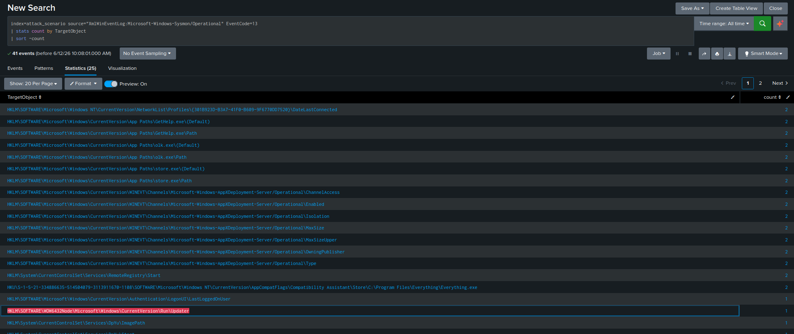
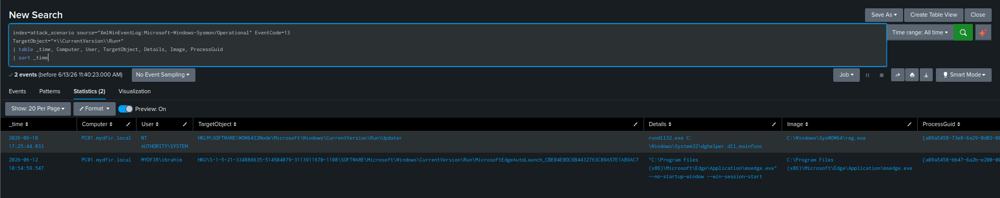
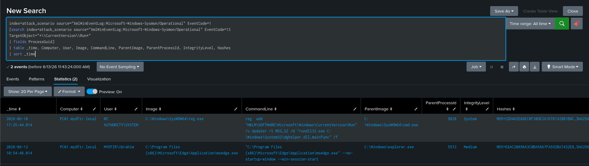

# Hunting Persistence: Registry Run Keys

[← Back to Hunting Persistence](README.md)

## Scenario

Moving up the kill chain to Persistence. The attacker has a foothold — now I'm hunting for evidence they tried to keep it. This covers the registry-based detection approach for **Boot/Logon Autostart Execution via Registry Run Keys (T1547.001)**, using Sysmon EID 13 as the primary registry telemetry source and correlating findings back to process creation via `ProcessGuid`.

**Index:** `attack_scenario` | **Time range:** All Time
**Primary source:** `XmlWinEventLog:Microsoft-Windows-Sysmon/Operational`, Event IDs `13` (registry), `1` (process creation)
**Fallback source:** `XmlWinEventLog:Security`, Event ID `4657`

**Hypothesis:** An attacker established persistence by modifying registry Run keys to trigger program execution at startup or user logon.

## What I Was Hunting For

- Registry value set events targeting known Run/RunOnce key paths
- The process responsible for each registry modification (`Image` + `ProcessGuid`)
- The value written — what binary or command executes at logon (`Details` field)
- Correlation of registry writes back to process creation events for full context
- A way to distinguish legitimate Run key entries from malicious ones
- Evidence that the persistence payload actually executed

## Key Registry Paths for Run Key Persistence

| Key | Scope |
|---|---|
| `HKCU\SOFTWARE\Microsoft\Windows\CurrentVersion\Run` | Every logon, current user |
| `HKCU\SOFTWARE\Microsoft\Windows\CurrentVersion\RunOnce` | Once for current user, then self-deletes |
| `HKLM\SOFTWARE\Microsoft\Windows\CurrentVersion\Run` | Every logon, all users — requires admin/SYSTEM to write |
| `HKLM\SOFTWARE\Microsoft\Windows\CurrentVersion\RunOnce` | Once for all users, then self-deletes |

**Important:** Sysmon doesn't log `HKCU` literally — it logs the actual resolved path under `HKU\<SID>\...`, giving me the specific user's Security Identifier directly in the event. That's more useful than `HKCU` because it removes ambiguity about exactly which account the entry belongs to.

**HKLM vs HKCU:** Writing to HKLM requires admin/SYSTEM privileges but triggers for every user — the higher-impact target for an attacker with elevated access. HKCU only needs user-level privileges but only fires for that one user's session.

**The WOW6432Node redirection trap:** Windows maintains a parallel registry hive for 32-bit applications. If a 32-bit process writes to `HKLM\SOFTWARE\`, the kernel silently redirects it to `HKLM\SOFTWARE\WOW6432Node\`. Any detection logic that hardcodes the native path alone will miss this — which is exactly what happened to me in this hunt, documented below rather than quietly corrected.

## Step 1 — Broad Registry Modification Hunt

```sql
index=attack_scenario source="XmlWinEventLog:Microsoft-Windows-Sysmon/Operational" EventCode=13
| stats count by TargetObject
| sort -count
```



| Field | Description |
|---|---|
| `TargetObject` | Full registry path of the key being modified |
| `Details` | The value being written |
| `Image` | Process that made the modification |
| `ProcessGuid` | Sysmon's unique process identifier — links to EID 1 |
| `User` | Account context of the change |

This is high-volume by design — the registry is constantly touched by the OS and installed applications. This first query is purely for orientation, not analysis.

## Step 2 — Filter to Known Persistence Paths

```sql
index=attack_scenario source="XmlWinEventLog:Microsoft-Windows-Sysmon/Operational" EventCode=13
TargetObject="*\\CurrentVersion\\Run*"
| table _time, Computer, User, TargetObject, Details, Image, ProcessGuid
| sort _time
```



This wildcard pattern matches both `HKU\<SID>\...\Run` (the resolved form of HKCU) and `HKLM\...\Run`, plus both `Run` and `RunOnce` variants.

**Results — 6 events:**

| Source Hive | Details Value | Suspicious? |
|---|---|---|
| `HKU\<SID>\...Run\MicrosoftEdge...` (×3) | `msedge.exe --no-startup-window --win-session-start` | No — Edge auto-launch |
| `HKU\<SID>\...Run\...` | Edge notification/cleanup entries | No — Edge background services |
| `HKLM\...RunOnce\...` | `setup.exe` reference | Worth investigating |
| `HKLM\...Run\Updater` | `rundll32.exe C:\Windows\System32\dghelper.dll,mainfunc` | **Yes — malicious** |

At this point I had what looked like a confirmed finding — and I want to be clear that the query above is scoped to only the standard native paths. The gap in this approach surfaces later in this hunt, and gets fixed in the lookup table writeup.

## Step 3 — Triage the Benign Entries (Microsoft Edge)

Three entries reference `msedge.exe` with flags like `--no-startup-window --win-session-start`. Before dismissing them:

**What makes them look suspicious at first glance:**
- A random-looking suffix in the key name (e.g., `MicrosoftEdgeAutoLaunch_CBE04E0`)
- The `--no-startup-window` flag, launching silently in the background

**How I confirmed they're legitimate:**
1. Checked `Image` — `msedge.exe` executing from `C:\Program Files (x86)\Microsoft\Edge\Application\`
2. Looked up the process via EchoTrail (rockyraccoon.io): returned Microsoft Edge, expected path confirmed
3. Recognized the random suffix as a known per-user/per-instance identifier Edge generates as part of its own auto-launch registration — not attacker-controlled randomization

**Decision:** Documented as expected baseline noise on any workstation with Edge installed. Moved on.

## Step 4 — Identify the Malicious Entry
TargetObject:  HKLM\SOFTWARE\Microsoft\Windows\CurrentVersion\Run\Updater

Details:       rundll32.exe C:\Windows\System32\dghelper.dll,mainfunc

Image:         C:\Windows\SysWOW64\reg.exe

User:          SYSTEM

| Field | Value | Why It's Suspicious |
|---|---|---|
| `TargetObject` | `HKLM\...\Run\Updater` | HKLM scope triggers for every user; "Updater" is a generic masquerading name |
| `Details` | `rundll32.exe ...dghelper.dll,mainfunc` | `rundll32` as a persistence payload is a defense evasion choice; `dghelper.dll` was already flagged as malware in the PowerShell execution hunt |
| `Image` | `SysWOW64\reg.exe` | 32-bit `reg.exe` — consistent with the 32-bit attacker chain identified throughout this investigation |
| `User` | `SYSTEM` | Confirms elevated privilege, not a routine interactive admin action |

## Step 5 — Correlate Registry Write to Process Creation via ProcessGuid

```sql
index=attack_scenario source="XmlWinEventLog:Microsoft-Windows-Sysmon/Operational" EventCode=1
[search index=attack_scenario source="XmlWinEventLog:Microsoft-Windows-Sysmon/Operational" EventCode=13
TargetObject="*\\CurrentVersion\\Run*"
| fields ProcessGuid]
| table _time, Computer, User, Image, CommandLine, ParentImage, ParentProcessId, IntegrityLevel, Hashes
| sort _time
```



The inner `[search ...]` runs first, pulling every EID 13 event matching the Run key path and extracting its `ProcessGuid`. Splunk then uses those GUID values as a filter against the outer search, which returns the EID 1 process creation events for the exact processes that made each registry change.

This is where the gap actually revealed itself. The result tied the registry modification directly to the attacker's `cmd.exe` session — but the `CommandLine` showed the attacker explicitly targeting `HKLM\SOFTWARE\Microsoft\Windows\CurrentVersion\Run`, the native 64-bit path. The `TargetObject` field from Step 4, however, hadn't reflected that — because of what comes next.

## Step 6 — Validate the Legitimate Entries via Hash Lookup

```sql
index=attack_scenario source="XmlWinEventLog:Microsoft-Windows-Sysmon/Operational" EventCode=1
[search index=attack_scenario source="XmlWinEventLog:Microsoft-Windows-Sysmon/Operational" EventCode=13
TargetObject="*\\CurrentVersion\\Run*"
| fields ProcessGuid]
| stats count by Hashes, Image
```

Took each unique hash and checked it against EchoTrail and VirusTotal:
- `msedge.exe` hash → confirmed Microsoft Edge, expected path, clean on VT
- `setup.exe` hash → high host prevalence, executes from temp (normal for installers), clean on VT

The `Company` field in Sysmon EID 1 is a useful quick filter, but it's not cryptographically verified — a signed Microsoft binary with a spoofed `Company` string is possible. Hash validation against VirusTotal is the authoritative check, not the PE metadata field.

## Step 7 — Fallback: Security EID 4657

```sql
index=attack_scenario source="XmlWinEventLog:Security" EventCode=4657
ObjectName IN ("*\\CurrentVersion\\Run*", "*\\CurrentVersion\\RunOnce*")
| table _time, Computer, SubjectUserName, ObjectName, OldValue, NewValue, ProcessName
| sort _time
```

| Concept | Sysmon EID 13 | Security EID 4657 |
|---|---|---|
| Registry path | `TargetObject` | `ObjectName` |
| Value written | `Details` | `NewValue` |
| Previous value | Not captured | `OldValue` |
| Modifying process | `Image` | `ProcessName` |
| Process GUID | `ProcessGuid` | Not available |

**Critical caveat:** EID 4657 requires a SACL pre-configured on the specific registry key — without it, the event never fires regardless of audit policy. Most environments don't have SACLs configured on Run keys by default, which means in practice this fallback will return nothing on most real engagements unless someone explicitly set it up in advance.

## Step 8 — Hunt for Persistence Payload Execution

```sql
index=attack_scenario source="XmlWinEventLog:Microsoft-Windows-Sysmon/Operational" EventCode=1
Image="*\\rundll32.exe"
CommandLine="*dghelper*"
| table _time, Computer, User, CommandLine, ParentImage, IntegrityLevel
| sort _time
```

**Expected parent at a normal logon:** `userinit.exe` → `explorer.exe` → `rundll32.exe`. Any other parent process is worth a closer look.

**What to check in `CommandLine`:**
- DLL path outside standard Microsoft locations
- An exported function name like `mainfunc` — legitimate `rundll32` calls reference documented exported functions, not generic, arbitrary-sounding names
- Missing arguments entirely — sometimes a sign the attacker stripped the command line after initial setup

## The Gap I Found

Here's what this hunt actually missed, and why: the registry redirection event for this exact entry didn't surface in my Step 2 query because the attacker's 32-bit `reg.exe` process triggered Windows' WOW64 registry redirection — silently rewriting the target from the native `HKLM\SOFTWARE\Microsoft\Windows\CurrentVersion\Run` path the attacker typed, into `HKLM\SOFTWARE\WOW6432Node\Microsoft\Windows\CurrentVersion\Run`. My wildcard pattern in Step 2 only covered the native path.

Process creation logs (Sysmon EID 1) showed attacker **intent** — the command line they typed. Registry modification logs (EID 13) showed the actual **effect** — where Windows really wrote it. These two can diverge, and a detection rule built only against one of them has a blind spot.

I solved this properly in the next part of this investigation rather than just patching this one query — see [Hunting Persistence: Lookup Tables →](hunting-lookup-tables.md).

## Key Findings

| Finding | Detail |
|---|---|
| Malicious Run key entry | `rundll32.exe C:\Windows\System32\dghelper.dll,mainfunc`, written under SYSTEM context by `SysWOW64\reg.exe` |
| Writing process parent | `SysWOW64\cmd.exe` (PID `9828`) — the same attacker shell identified throughout this investigation |
| Benign noise identified and confirmed | 5 entries — Microsoft Edge auto-launch, verified via EchoTrail and VirusTotal hash lookup |
| Coverage gap discovered | Native-path-only query missed the WOW64-redirected actual location of the write |
| Technique layering | T1547.001 (Run key) combined with T1218.011 (Rundll32 proxy execution) |

## ATT&CK Mapping

| Tactic | Technique | ID |
|---|---|---|
| Persistence | Boot/Logon Autostart: Registry Run Keys / Startup Folder | T1547.001 |
| Defense Evasion | System Binary Proxy Execution: Rundll32 | T1218.011 |
| Defense Evasion | Masquerading: Match Legitimate Name or Location | T1036.005 |
| Execution | Command and Scripting Interpreter: Windows Command Shell | T1059.003 |

## Detection Opportunities

- Sysmon EID 13 where `TargetObject` matches `*\CurrentVersion\Run*` AND `User=SYSTEM` — SYSTEM writing Run keys outside known software install windows is almost always malicious
- Any Run key `Details` value containing `rundll32.exe`
- `reg.exe` spawned by a shell interpreter under SYSTEM integrity context
- A maintained baseline of legitimate Run key entries per host type, alerting on any new entry outside that baseline

## What I Took Away From This Hunt

- **`ProcessGuid` is the correct pivot for cross-event correlation, not `ProcessId`.** PIDs get recycled by the OS; GUIDs are unique per process instance for the life of the Sysmon log. I used it here to tie the registry write back to the exact attacker shell session without ambiguity.
- **The key name itself is meaningless as a detection signal.** `Updater`, `WindowsDefender`, `AdobeUpdate` — trivially renamed by any attacker. The actual signal is in `Details` (what runs) and `Image` (what wrote it).
- **RunOnce keys self-delete after firing.** Post-incident, the live registry might show nothing, even though the Sysmon log captured the write event when it happened. This is a direct argument for centralized log forwarding being non-negotiable — the log may be the only surviving evidence.
- **The real lesson of this hunt wasn't the malicious entry — it was the gap in how I looked for it.** A hardcoded wildcard pattern scoped to "the four standard paths" is a reasonable starting point, but it's not coverage. I'm documenting that gap explicitly rather than smoothing it out of the final writeup, because catching your own blind spot is a more valuable skill to demonstrate than presenting a hunt that looked clean from the first query.

---

**Next:** [Hunting Persistence: Lookup Tables →](hunting-lookup-tables.md)
