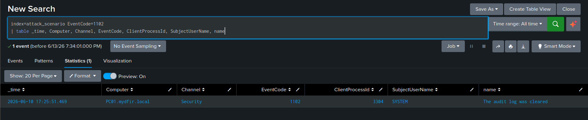
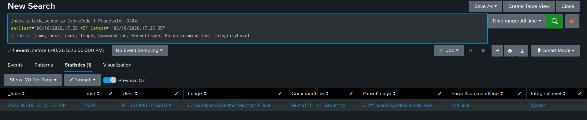
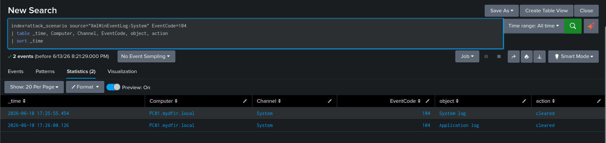
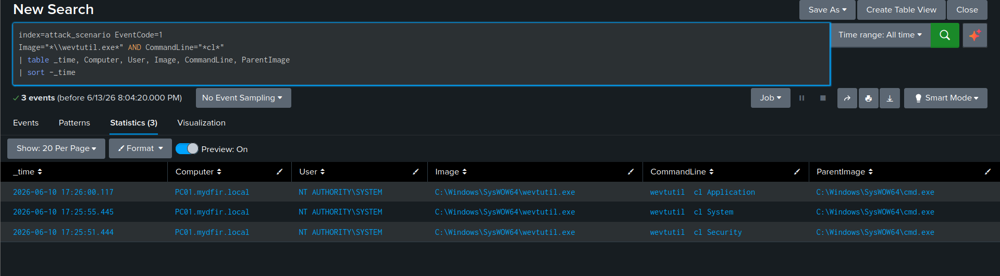
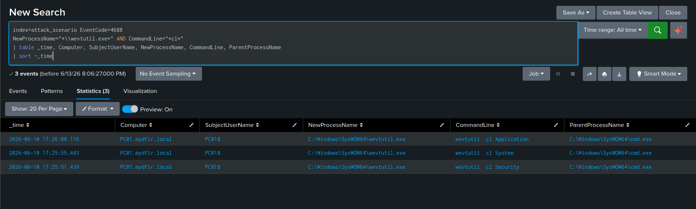

# Hunting Defense Evasion: Log Clearing

[← Back to main README](../README.md)

## Scenario

By this point in the intrusion, the attacker has executed commands, dropped tools, modified the registry for persistence, and harvested credentials. Now they're cleaning up. This hunt targets **Indicator Removal: Clear Windows Event Logs (T1070.001)** — one of the most mechanically simple techniques in this entire investigation to detect, and one of the most important to alert on immediately when it fires.

I deliberately approached this using three complementary angles rather than one query: the native Windows log-clear event IDs themselves, PID correlation back to the responsible process, and direct command-line hunting via both Sysmon and Security EID 4688.

**Index:** `attack_scenario` | **Time range:** All Time

**Log sources:**
- `XmlWinEventLog:Security` → EID `1102` (security log cleared)
- `XmlWinEventLog:System` → EID `104` (system/application log cleared)
- `XmlWinEventLog:Microsoft-Windows-Sysmon/Operational` → EID `1` (process creation)
- `XmlWinEventLog:Security` → EID `4688` (process creation fallback)

**Hypothesis:** An attacker attempted to evade detection by clearing local Windows Event Logs using `wevtutil.exe`.

## What I Was Hunting For

- Security EID 1102 — audit log cleared
- System EID 104 — system/application log cleared
- `wevtutil.exe` process creation with the `cl` (clear) argument
- The user context and parent process that triggered the log clear
- PID correlation between the log-clear event and the responsible process creation event
- Temporal clustering — multiple log clears within seconds of each other

## Why This Hunt Matters

**The attacker's goal here is straightforward:** remove local forensic evidence before disconnecting, making it harder for an investigator to reconstruct the timeline or even confirm an intrusion took place at all.

**Why it largely fails against a properly architected environment:** if logs are forwarded to a SIEM in real time, clearing them locally is cosmetic. Everything already shipped to Splunk before the clear command ran is untouched. To actually suppress collection, the attacker would need to kill the Splunk Universal Forwarder agent itself — which is a separate, independently detectable action in its own right.

**The paradox that makes this technique self-defeating:** when Windows clears an event log, it writes a record of that clearing action to the same log *before* wiping it. EID 1102 and EID 104 are generated at the moment of clearing and survive the wipe. There is no way to clear the log without simultaneously leaving behind the event that says it was cleared.

**Legitimate use cases exist but are rare.** IT administrators occasionally clear logs during troubleshooting or to reclaim disk space. Those actions should be documented, scheduled, and performed under a named admin account — not under SYSTEM, not from inside a shell session, and not at an unusual hour. Any deviation from that profile is worth investigating on its own.

## Step 1 — Hunt for Security Log Clear (EID 1102)

```sql
index=attack_scenario source="XmlWinEventLog:Security" EventCode=1102
| table _time, Computer, Channel, EventCode, ClientProcessId, SubjectUserName, name
| sort _time
```



| Field | Description |
|---|---|
| `SubjectUserName` | Account that performed the clear — SYSTEM context is immediately suspicious |
| `ClientProcessId` | PID of the responsible process — my pivot point for the next step |
| `Channel` | Confirms this fired from the Security log |
| `name` | Human-readable description: "The audit log was cleared" |

**Result:** A single event, triggered under `NT AUTHORITY\SYSTEM` context.

**Immediate triage questions I asked before moving on:** Who performed it? When did it happen relative to everything else in this intrusion? What process (`ClientProcessId`) is responsible? Does it fit the attack timeline I'd already established across the previous hunts?

## Step 2 — Correlate the Log Clear to Its Process via PID

The `ClientProcessId` from the EID 1102 event (`3304`) tells me which process cleared the log. I pivoted to Sysmon EID 1 to find it — but scoped the time window tightly, because Windows reuses PIDs and an unscoped search risks pulling back an unrelated process that happened to reuse the same number at a different point in time.

```sql
index=attack_scenario source="XmlWinEventLog:Microsoft-Windows-Sysmon/Operational" EventCode=1
ProcessId=3304
earliest="06/10/2026:17:25:45" latest="06/10/2026:17:25:55"
| table _time, Computer, User, Image, CommandLine, ParentImage, IntegrityLevel
| sort _time
```



The EID 1102 timestamp is the anchor for this window — a ±5 second range around it is enough to isolate the exact process instance responsible, without pulling in noise from a different process that happened to reuse PID 3304 at some other point during the session.

**Result:**
Image:          C:\Windows\SysWOW64\wevtutil.exe

CommandLine:    wevtutil cl Security

ParentImage:    C:\Windows\SysWOW64\cmd.exe

IntegrityLevel: System

User:           NT AUTHORITY\SYSTEM

The `SysWOW64` path is consistent with the entire 32-bit attacker chain confirmed across every previous hunt in this lab: `MyMVPfXG.exe` (PE32) → `SysWOW64\cmd.exe` → `SysWOW64\wevtutil.exe`.

## Step 3 — Hunt System and Application Log Clears (EID 104)

EID 104 covers log clears outside the Security channel — System, Application, and others.

```sql
index=attack_scenario source="XmlWinEventLog:System" EventCode=104
| table _time, Computer, Channel, EventCode, object, action
| sort _time
```



| Field | Description |
|---|---|
| `object` | Name of the log that was cleared (e.g., `System`, `Application`) |
| `Channel` | Always `System` — EID 104 itself lives in the System log regardless of which log it's reporting on |
| `action` | The "cleared" message |

**Result:** Two events — the System log and the Application log — both landing within seconds of the Security log clear from Step 1.

This temporal clustering is itself a signal worth calling out explicitly: three log clears within the same minute, all under SYSTEM context, is exactly the pattern I'd expect from a scripted attacker cleanup routine. A real administrator clearing a log typically has a specific reason tied to one specific log — clearing three different logs back to back in seconds is not how routine maintenance behaves.

## Step 4 — Hunt wevtutil.exe Process Creation Directly

Rather than relying only on the PID-pivot approach, I also hunted the responsible process directly by its command-line signature — this doesn't require already having an EID 1102/104 event in hand first.

```sql
index=attack_scenario source="XmlWinEventLog:Microsoft-Windows-Sysmon/Operational" EventCode=1
Image="*\\wevtutil.exe" CommandLine="*cl*"
| table _time, Computer, User, Image, CommandLine, ParentImage, IntegrityLevel
| sort _time
```



**What to look for in results:**
- Multiple events seconds apart — one per log cleared (`cl Security`, `cl System`, `cl Application`)
- `ParentImage` — `wevtutil.exe` spawned from `cmd.exe` or `powershell.exe` is suspicious; spawned from a known management tool or scheduled task could be legitimate and deserves separate triage
- `IntegrityLevel: System` confirming highest-privilege execution
- `User: NT AUTHORITY\SYSTEM` rather than an interactive admin account

**Result:** Three events, seconds apart, every one of them `wevtutil.exe` clearing a different log, every one of them spawned from the same `SysWOW64\cmd.exe` session already identified throughout this intrusion.

## Step 5 — Same Hunt via Security EID 4688 (Fallback)

```sql
index=attack_scenario source="XmlWinEventLog:Security" EventCode=4688
NewProcessName="*\\wevtutil.exe"
CommandLine="*cl *"
| table _time, Computer, SubjectUserName, NewProcessName, CommandLine, ParentProcessName
| sort _time
```



| Concept | Sysmon EID 1 | Security EID 4688 |
|---|---|---|
| Process path | `Image` | `NewProcessName` |
| Parent path | `ParentImage` | `ParentProcessName` |
| User | `User` | `SubjectUserName` |
| Hash values | Yes | No |
| Process GUID | Yes | No |

**Result:** Identical findings — the same three `wevtutil.exe` executions, the same command lines, the same parent process. This confirms Security EID 4688 with command-line auditing enabled is a fully viable fallback for this specific detection when Sysmon isn't deployed.

## Step 6 — Broad Log Clear Detection (Combined Query)

For something closer to a standing detection rule rather than an ad-hoc hunt, I combined both event IDs into a single unified view:

```sql
index=attack_scenario (
    (source="XmlWinEventLog:Security" EventCode=1102) OR
    (source="XmlWinEventLog:System" EventCode=104)
)
| eval log_cleared=case(
    EventCode=1102, "Security Log",
    EventCode=104, coalesce(object, "Unknown Log")
)
| table _time, Computer, EventCode, log_cleared, SubjectUserName
| sort _time
```

This gives a single readable table of every log-clear event across both channels, with a human-readable `log_cleared` field showing exactly which log was affected on each row. In a production environment, this is the shape of query I'd turn into a saved alert — any hit here should trigger an investigation by default, given how rare the legitimate use case is.

## Full Attack Chain Confirmation

Cross-referencing these log-clear timestamps against the attacker timeline established across every previous hunt in this lab confirms exactly where this fits:
[17:25:45 approx]

SysWOW64\cmd.exe

├── wevtutil.exe → cl Security    ← EID 1102 fired

├── wevtutil.exe → cl System      ← EID 104 fired

└── wevtutil.exe → cl Application ← EID 104 fired

All three executions spawn from the same attacker `cmd.exe` session identified throughout this investigation. This confirms log clearing as the **final phase** of attacker activity on this host before disconnecting — consistent with the attack chain documented in Phase 1.

## Key Findings

| Finding | Detail |
|---|---|
| Security log cleared | EID 1102 — `NT AUTHORITY\SYSTEM` context |
| System log cleared | EID 104 — confirmed via `object` field |
| Application log cleared | EID 104 — confirmed via `object` field |
| All three within seconds | Temporal clustering confirms deliberate, scripted attacker cleanup |
| Responsible process | `SysWOW64\wevtutil.exe` — 32-bit, consistent with the attacker chain |
| Parent process | `SysWOW64\cmd.exe` — the same attacker shell identified across every previous hunt |
| Effectiveness | Zero — every event had already been forwarded to Splunk in real time |

## ATT&CK Mapping

| Tactic | Technique | ID |
|---|---|---|
| Defense Evasion | Indicator Removal: Clear Windows Event Logs | T1070.001 |
| Defense Evasion | Indicator Removal: File Deletion | T1070.004 |
| Execution | Command and Scripting Interpreter: Windows Command Shell | T1059.003 |

## Detection Opportunities

- **High:** Any EID 1102 in the Security log — near-zero legitimate use cases, should auto-escalate to an analyst on sight
- **High:** Any EID 104 in the System log — same rationale
- **High:** `wevtutil.exe` with a `cl` argument, especially under SYSTEM context or spawned from a shell interpreter
- **Medium:** Three or more EID 104/1102 events within 60 seconds on the same host — indicates bulk clearing consistent with scripted attacker cleanup rather than routine maintenance
- **Medium:** `Clear-EventLog` or `Remove-EventLog` PowerShell cmdlets appearing in EID 4103/4104 logs — covers the PowerShell-based equivalent of the same technique
- **Architectural:** real-time log forwarding to a SIEM is the actual control here, not endpoint log permissions — any environment without it should be treated as critically under-defended regardless of what other detections are in place

## What I Took Away From This Hunt

- **This is the one technique in this entire lab where the detection genuinely cannot be evaded by the attacker, short of disabling log forwarding itself.** The act of clearing the log is what generates the evidence of clearing the log. That's a rare guarantee in threat hunting, and it's worth recognizing exactly why it holds — most detections rely on the attacker not thinking to evade them; this one holds even if they do.
- **PID correlation requires a tight time window, and I deliberately built this hunt to make that explicit.** Windows reuses process IDs constantly. Anchoring the search window to the EID 1102 timestamp rather than searching all time for that PID is what kept this correlation accurate instead of accidentally pulling in an unrelated process.
- **Temporal clustering is its own independent signal, separate from any single event's content.** Three log clears in the same minute under SYSTEM context told me something the content of any single EID 104 event couldn't on its own — that this was a scripted, sequential action, not a one-off administrative task.
- **I validated the same finding through two independent log sources (Sysmon and Security EID 4688) on purpose**, not because I expected them to disagree, but because confirming identical results from an entirely different telemetry pipeline is exactly the kind of cross-validation that turns "I found something" into "I'm confident in what I found."

---

**Next:** [Hunting Command & Control →](../05-hunting-command-and-control/README.md)
