# Hunting Lateral Movement: PSExec

[← Back to main README](../README.md)

## Scenario

Lateral movement is where an attacker pivots from their initial foothold into the broader environment — and it generates some of the most forensically rich artifacts in Windows telemetry of any technique in this lab. This chapter covers four complementary detection angles for PSExec-based lateral movement, building from high-level service creation events down to low-level named pipe activity.

This chapter is also where I did the work I'm most proud of in this whole project: rather than hunting for the specific known values this attacker happened to generate, I pulled Impacket's actual source code, reverse-engineered exactly how it generates service and binary names, and wrote regex-based detections that catch the *technique* — meaning they'd still catch this exact tool on a completely different run, with completely different random values, on a host I've never seen.

**Index:** `attack_scenario` | **Time range:** All Time

**Primary sources:**
- `XmlWinEventLog:System` → EID `7045` (service installation)
- `XmlWinEventLog:Microsoft-Windows-Sysmon/Operational` → EID `1`, `11`, `13`, `17`, `18`
- `XmlWinEventLog:Security` → EID `4624` (logon events)

**Known IOCs going into this hunt, confirmed across previous chapters:**
- PSExec service name: `DpYu` (4-letter random alphabetic string)
- PSExec service binary: `MyMVPfXG.exe` (8-letter random alphabetic string + `.exe`)
- Attacker shell PID: `9828` (`SysWOW64\cmd.exe`)
- C2 IP: `192.168.7.250`

**Hypothesis:** An attacker with an established foothold is attempting lateral movement using PSExec or similar tooling that enables remote service creation and command execution.

## What I Was Hunting For

| Question | Evidence Source | Event ID |
|---|---|---|
| Were any new services created that could indicate PSExec? | Windows System Log | 7045 |
| Are there registry modifications matching service creation paths? | Sysmon Registry | 13 |
| Were any suspicious binaries written to the ADMIN$ share? | Sysmon File Create | 11 |
| Do process trees show `services.exe` spawning shells or random binaries? | Sysmon Process Create | 1 |
| Were named pipes created or connected matching Impacket's pipe naming convention? | Sysmon Pipe Events | 17, 18 |

## How PSExec Actually Works, and Why It Leaves So Many Artifacts

Understanding the tool's mechanics is the foundation for every detection in this chapter.

**Sysinternals PSExec** (the legitimate tool, frequently abused):
1. Connects to the target via SMB → accesses the `ADMIN$` share
2. Uploads `PSEXESVC.exe` to `C:\Windows\`
3. Creates and starts a service named `PSEXESVC`
4. The service executes the specified command
5. Creates the named pipe `\\.\pipe\PSEXESVC` for I/O

**Impacket's `psexec.py`** (the attacker reimplementation used in this intrusion):
1. Connects via SMB → finds a writable share (`ADMIN$`)
2. Uploads a randomly-named **8-letter** binary — `MyMVPfXG.exe` — to `C:\Windows\`
3. Creates and starts a service with a randomly-named **4-letter** alphabetic string — `DpYu`
4. The service executes the specified payload (`cmd.exe` in this case)
5. Creates named pipes using the **`RemCom`** naming convention for I/O

**Every single step generates a distinct artifact:**

| PSExec Action | Artifact | Log Source |
|---|---|---|
| SMB share access | Share access event | Security EID 5140 |
| File upload to ADMIN$ | File creation in `C:\Windows\` | Sysmon EID 11 |
| Service creation | Service install event | System EID 7045 |
| Service registry entry | Registry value set | Sysmon EID 13 |
| Service execution | Process creation | Sysmon EID 1 |
| Named pipe creation | Pipe create | Sysmon EID 17 |
| Named pipe connection | Pipe connect | Sysmon EID 18 |

## Angle 1 — Service Creation Events

### Step 1 — Hunt System EID 7045 (Service Installed)

The most direct and reliable signal available here. Windows generates EID 7045 whenever a new service is installed, regardless of how — GUI, `sc.exe`, PSExec, direct API calls. On a user workstation, service creation is rare outside actual software installations, which makes every single hit on this query worth a close look.

```sql
index=attack_scenario source="XmlWinEventLog:System" EventCode=7045
| table _time, Computer, AccountName, ServiceName, ImagePath, ServiceType, StartType
| sort _time
```

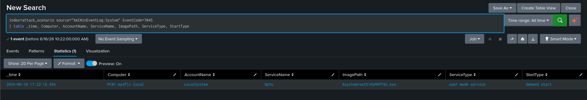

| Field | Description |
|---|---|
| `ServiceName` | Assigned name — a random 4-letter string for Impacket PSExec |
| `ImagePath` | Full path to the service executable |
| `StartType` | `Demand Start` = manually triggered; `Auto Start` = runs at boot |
| `AccountName` | Account the service runs under — `LocalSystem` means SYSTEM privileges |

**Why every single field here is a red flag:**

| Field | Value | Why It's Suspicious |
|---|---|---|
| `ServiceName` | `DpYu` | A 4-letter random string — not a recognizable Windows service name |
| `ImagePath` | `%SystemRoot%\MyMVPfXG.exe` | A random 8-letter binary sitting directly in the Windows root |
| `StartType` | `Demand Start` | Manually triggered, not persistent — exactly consistent with PSExec's temporary execution model |
| `AccountName` | `LocalSystem` | Highest privilege level available — full system access |

Legitimate service installs have recognizable names (`wuauserv`, `Spooler`, vendor-named services), signed executables from expected paths like `C:\Program Files\...`, and are tied to an installer process. None of those characteristics are present here.

### Step 2 — Correlate Service Creation to the Registry

When a service is created, Windows writes its configuration to `HKLM\SYSTEM\CurrentControlSet\Services\<ServiceName>\ImagePath`. I hunted this as a secondary confirmation — and it's also the fallback if EID 7045 ever gets cleared.

```sql
index=attack_scenario source="XmlWinEventLog:Microsoft-Windows-Sysmon/Operational" EventCode=13
TargetObject="*\\System\\CurrentControlSet\\Services\\*\\ImagePath"
| table _time, Computer, User, TargetObject, Details, Image, ProcessId
| sort _time
```

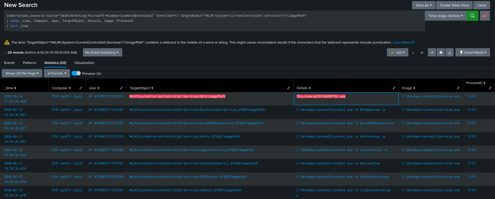

**Results:**

| TargetObject | Details | Suspicious? |
|---|---|---|
| `HKLM\...\Services\MicrosoftEdgeElevationService\ImagePath` | Normal Edge path | No |
| `HKLM\...\Services\DpYu\ImagePath` | `C:\Windows\MyMVPfXG.exe` | **Yes** |

**At scale, the aggregate version:**

```sql
index=attack_scenario source="XmlWinEventLog:Microsoft-Windows-Sysmon/Operational" EventCode=13
TargetObject="*\\CurrentControlSet\\Services\\*\\ImagePath"
| stats values(TargetObject) as TargetObject values(Details) as ImagePath by Image, Computer
```

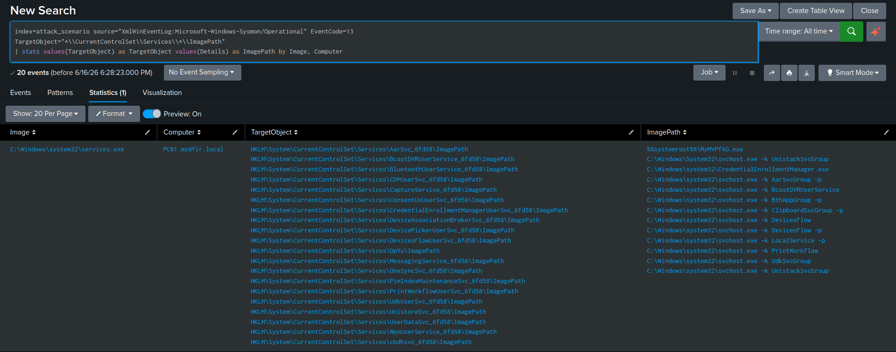

This groups every service executable path registry write by the process that made it and the host it happened on — useful for spotting an outlier across multiple systems without reading individual events one at a time.

## Angle 2 — Reversing Impacket's Naming Logic for Regex Detection

This is the centerpiece of this chapter, and the part of this entire lab I'd point to first in an interview.

### The Malware Author's Paradox

Attackers face a real trade-off when naming the artifacts their tools generate:

**Option 1 — legitimate-sounding names** (`WindowsUpdate`, `Spooler`): blends in at a glance, but once any single instance is identified, it becomes a precise static IOC that can be signatured globally and detected reliably forever after.

**Option 2 — random names** (`DpYu`, `MyMVPfXG.exe`): prevents a single static signature from working across multiple runs, but random names stand out immediately to a trained analyst — and more importantly, the *randomization logic itself* is a fixed, fingerprintable pattern.

Impacket chose Option 2. Reading the source code is how that choice gets turned against the tool.

### Step 3 — Read the Impacket Source Code

The `serviceinstall.py` module in the Impacket toolkit contains the actual naming logic:

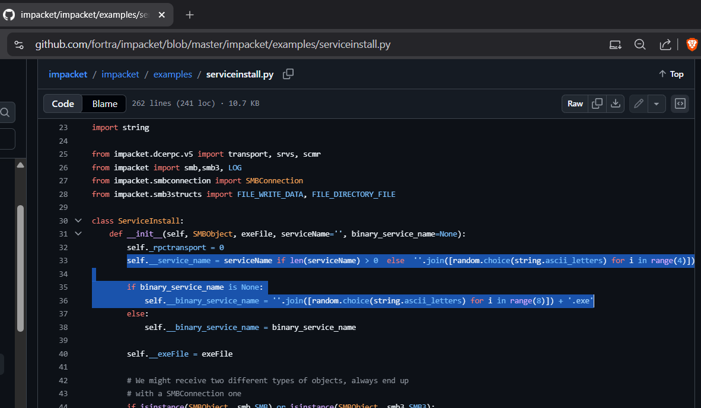

**Decoded:**

| Artifact | Character Set | Length | Example |
|---|---|---|---|
| Service name | `string.ascii_letters` = `a-zA-Z` | exactly **4** characters | `DpYu`, `PTQC`, `abCD` |
| Binary name | `string.ascii_letters` = `a-zA-Z` | exactly **8** characters + `.exe` | `MyMVPfXG.exe`, `THybZSNv.exe` |

`string.ascii_letters` in Python is the constant `abcdefghijklmnopqrstuvwxyzABCDEFGHIJKLMNOPQRSTUVWXYZ` — alphabetic characters only, no digits, no special characters. This single line of source code is the intelligence behind every regex detection in the rest of this chapter.

### Step 4 — Build and Test the Regex Patterns

**Pattern 1 — 4-letter alphabetic service name:**
^[a-zA-Z]{4}$
Matches `DpYu`, `PTQC`, `abCD`, `XYZQ`. Does not match `svchost` (too long), `wuauserv` (too long), `abc1` (contains a digit).

**Pattern 2 — 8-letter alphabetic binary name + `.exe`:**
^[a-zA-Z]{8}.exe$
Matches `MyMVPfXG.exe`, `THybZSNv.exe`, `abcdEFGH.exe`. Does not match `notepad.exe` (7 characters), `svchost.exe` (7 characters), `calc1234.exe` (contains digits).

I tested both patterns at regex101.com against known-good and known-bad examples before operationalizing either one into Splunk — validating a pattern against the wrong dataset for the first time is how false positives or false negatives sneak into production detections.

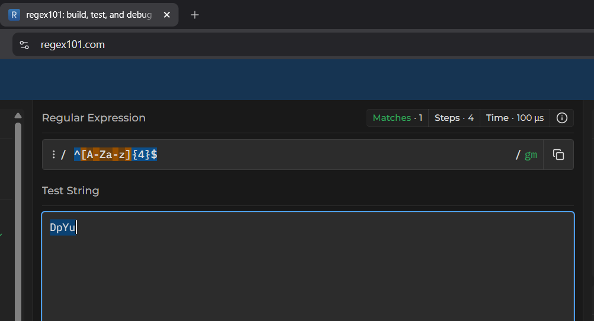
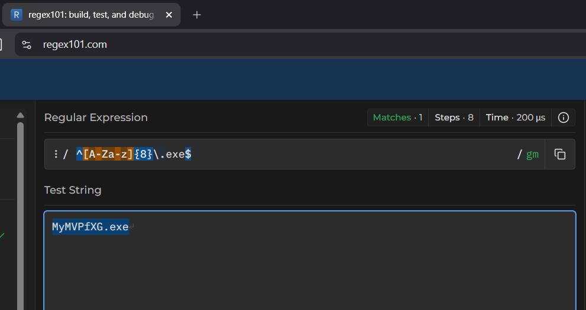

### Step 5 — Regex Hunt: Service Name Pattern (EID 7045)

```sql
index=attack_scenario source="XmlWinEventLog:System" EventCode=7045
| regex ServiceName="^[a-zA-Z]{4}$"
| table _time, Computer, AccountName, ServiceName, ImagePath, ServiceType, StartType
| sort _time
```

An equivalent form using `where match()` instead of the `regex` command:

```sql
index=attack_scenario source="XmlWinEventLog:System" EventCode=7045
| where match(ServiceName, "^[a-zA-Z]{4}$")
| table _time, Computer, AccountName, ServiceName, ImagePath, ServiceType, StartType
| sort _time
```

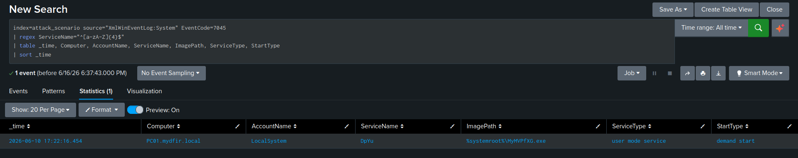

**Result:** The `DpYu` service matches, because it's exactly 4 alphabetic characters.

**Why this matters more than just hunting for `DpYu` directly:** the next time this tool runs, the service name will be something else entirely — `XkRp`, `mNqT`, whatever the random module produces. The static IOC catches only the one specific value I already know about. The regex catches every one of them, including ones I haven't seen yet.

### Step 6 — Regex Hunt: Service Registry Key by Name Pattern

```sql
index=attack_scenario source="XmlWinEventLog:Microsoft-Windows-Sysmon/Operational" EventCode=13
| regex TargetObject="HKLM\\\\System\\\\CurrentControlSet\\\\Services\\\\[A-Za-z]{4}\\\\ImagePath"
| table _time, Computer, User, TargetObject, Details, Image
| sort _time
```

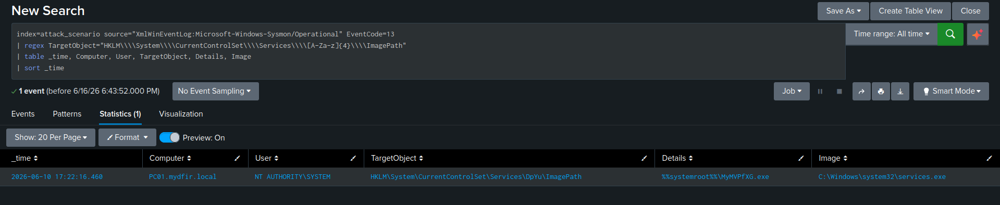

The quadruple backslash here isn't a typo — Splunk's `regex` command requires backslashes double-escaped: once for the regex engine, once for Splunk's own string parser. A single literal backslash in a registry path becomes `\\\\` in the Splunk regex string. This catches any service registry entry where the service name is exactly 4 alphabetic characters, regardless of what that specific name is.

### Step 7 — Regex Hunt: Service Binary Path Pattern (EID 7045)

```sql
index=attack_scenario source="XmlWinEventLog:System" EventCode=7045
| regex ImagePath="\\\\[A-Za-z]{8}\.exe$"
| table _time, Computer, AccountName, ServiceName, ImagePath, ServiceType, StartType
| sort _time
```

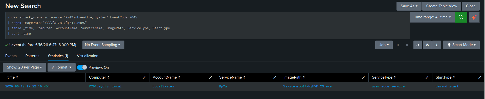

**Result:** `%SystemRoot%\MyMVPfXG.exe` — the `ImagePath` ends in an 8-letter alphabetic string followed by `.exe`, matched without needing to know the specific filename in advance.

### Step 8 — Regex Hunt: Service Registry Value by Binary Pattern

```sql
index=attack_scenario source="XmlWinEventLog:Microsoft-Windows-Sysmon/Operational" EventCode=13
TargetObject="*\\CurrentControlSet\\Services\\*\\ImagePath"
| regex Details="\\\\[A-Za-z]{8}\.exe"
| table _time, Computer, User, TargetObject, Details, Image
| sort _time
```

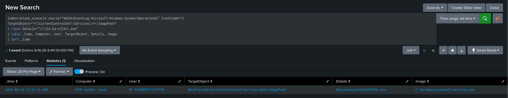

This catches registry writes to any service's `ImagePath` where the value itself points to an 8-letter alphabetic executable — again, without needing to know the service name or binary name ahead of time.

### Step 9 — Regex Hunt: File Creation of the 8-Letter Executable

```sql
index=attack_scenario source="XmlWinEventLog:Microsoft-Windows-Sysmon/Operational" EventCode=11
| regex TargetFilename="C:\\\\Windows\\\\[A-Za-z]{8}\.exe"
| table _time, Computer, User, TargetFilename, Image, ProcessId
| sort _time
```

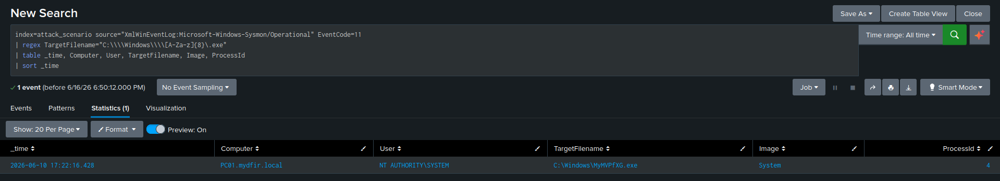

I deliberately scoped this to `C:\Windows\` rather than running the 8-letter pattern globally. Without that path scope, the pattern would also match legitimate 8-letter binaries elsewhere on the system — `soundrec.exe` and `xpdagent.exe` both happen to be exactly 8 letters. Scoping to `C:\Windows\` directly — which is where PSExec's `ADMIN$` upload actually lands — eliminates those false positives entirely.

**Result:**
TargetFilename: C:\Windows\MyMVPfXG.exe

Image:          System (PID 4)

Written by the `System` process (PID 4) — the kernel — because PSExec's upload happens over SMB and the kernel handles that network write directly.

### Regex Detection Summary

| Artifact | Log Source | EID | Field | Pattern |
|---|---|---|---|---|
| Service name | System | 7045 | `ServiceName` | `^[a-zA-Z]{4}$` |
| Service name in registry | Sysmon | 13 | `TargetObject` | `Services\\[a-zA-Z]{4}\\ImagePath` |
| Binary name in ImagePath | System | 7045 | `ImagePath` | `\\[a-zA-Z]{8}\.exe$` |
| Binary name in registry value | Sysmon | 13 | `Details` | `\\[a-zA-Z]{8}\.exe` |
| Binary dropped to C:\Windows\ | Sysmon | 11 | `TargetFilename` | `C:\\Windows\\[a-zA-Z]{8}\.exe` |

**Why this matters in Pyramid of Pain terms:** these patterns target Impacket's tool *behavior*, not a specific hash, IP, or service name. Changing the specific random values this tool generates next time costs the attacker absolutely nothing — they don't even have to think about it, the randomization does it automatically. Changing the *fundamental randomization logic* itself requires the attacker to actually rewrite their tooling. That's a meaningful cost imposed on the adversary, which is the entire point of moving detection logic higher up the pyramid instead of chasing static IOCs that expire the moment the attacker reruns their tool.

## Angle 3 — Named Pipe Detection

### Background: PSExec Named Pipes

When PSExec establishes a session, it creates named pipes — IPC channels carrying command input and output between the attacker's client and the service binary on the target.

**Sysinternals PSExec's pipe name:** `\\.\pipe\PSEXESVC`

**Impacket's pipe names**, found directly in the `psexec.py` source by searching for `RemCom`:

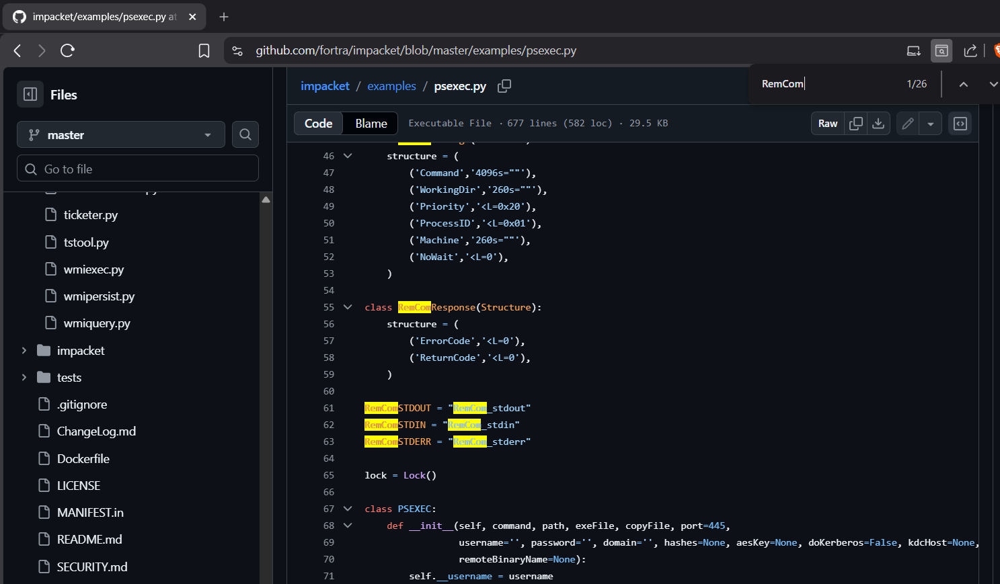

| Pipe Name | Purpose |
|---|---|
| `\\.\pipe\RemCom_communicaton` | Main command channel |
| `\\.\pipe\RemCom_stdin` | Standard input (attacker → target) |
| `\\.\pipe\RemCom_stdout` | Standard output (target → attacker) |
| `\\.\pipe\RemCom_stderr` | Standard error (target → attacker) |

**Why this matters for detection specifically:** unlike the randomly-generated service and binary names, these pipe names are hardcoded directly in the Impacket source. They don't change between runs, ever — which makes them high-precision, near-zero-false-positive indicators. This is exactly the kind of artifact that belongs at the very top of a detection priority list.

**Sysmon coverage:** EID 17 logs named pipe creation, EID 18 logs named pipe connection.

### Step 11 — Hunt Named Pipe Creation and Connection

```sql
index=attack_scenario source="XmlWinEventLog:Microsoft-Windows-Sysmon/Operational"
EventCode IN (17, 18)
PipeName="*RemCom*"
| table _time, Computer, User, EventCode, EventType, PipeName, Image, ProcessId
| sort _time
```

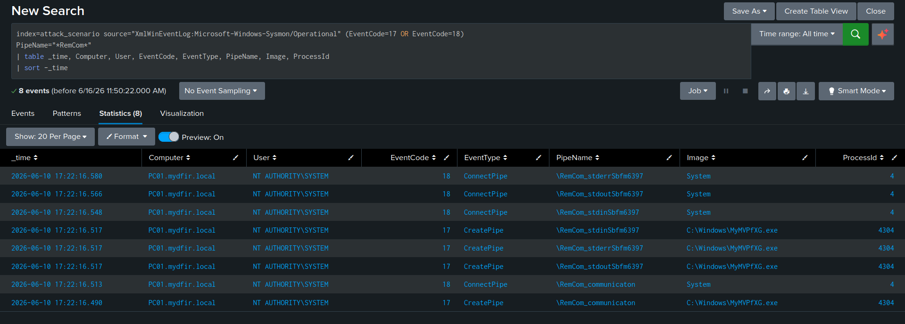

The single wildcard `*RemCom*` catches all four pipe names in one filter.

**Results — 8 events:**

| EventCode | Image | PipeName | Significance |
|---|---|---|---|
| 17 | `C:\Windows\MyMVPfXG.exe` | `RemCom_communicaton` | Service binary created the main command pipe |
| 18 | `System` (PID 4) | `RemCom_communicaton` | Kernel connected to the command pipe |
| 17 | `C:\Windows\MyMVPfXG.exe` | `RemCom_stdin` | Service binary created the stdin pipe |
| 18 | `System` (PID 4) | `RemCom_stdin` | Kernel connected to stdin |
| 17 | `C:\Windows\MyMVPfXG.exe` | `RemCom_stdout` | Service binary created the stdout pipe |
| 18 | `System` (PID 4) | `RemCom_stdout` | Kernel connected to stdout |
| 17 | `C:\Windows\MyMVPfXG.exe` | `RemCom_stderr` | Service binary created the stderr pipe |
| 18 | `System` (PID 4) | `RemCom_stderr` | Kernel connected to stderr |

**Reading this sequence:** the EID 17 events show `MyMVPfXG.exe` — the PSExec service binary — creating all four pipes. The EID 18 events immediately following show `System` (PID 4, the kernel) connecting to each one. Together, this is the exact mechanism by which PSExec establishes the communication channel that delivers command input and streams output back in real time between the attacker's client and the target. All eight events can land within the same second — the creation-and-connection handshake happens almost instantaneously at session establishment.

## Full PSExec Detection Chain — Complete Picture
ATTACKER

│

│ SMB connection to ADMIN$ share

│ → Security EID 5140 (share access)

│

├── File uploaded: C:\Windows\MyMVPfXG.exe

│   → Sysmon EID 11 (file create, written by System PID 4)

│

├── Service created: DpYu

│   → System EID 7045 (service installed)

│   → Sysmon EID 13 (registry: HKLM...\Services\DpYu\ImagePath)

│

├── Service started → MyMVPfXG.exe executes

│   → Sysmon EID 1 (process create, parent: services.exe)

│   → IntegrityLevel: System

│

├── Named pipes created by MyMVPfXG.exe

│   → Sysmon EID 17: RemCom_communicaton, stdin, stdout, stderr

│

├── System (PID 4) connects to pipes

│   → Sysmon EID 18: all four RemCom pipes

│

└── cmd.exe spawned under MyMVPfXG.exe

→ Sysmon EID 1 (PID 9828 — attacker's interactive shell)

→ All subsequent attacker commands execute under this process

Every node in this chain was independently confirmed across this lab — service creation in this chapter, the shell and its child processes in the Execution Artifacts hunt, and everything that shell went on to do across Persistence, Defense Evasion, and Command & Control.

## ATT&CK Mapping

| Tactic | Technique | ID |
|---|---|---|
| Lateral Movement | Remote Services: SMB/Windows Admin Shares | T1021.002 |
| Persistence / Execution | Create or Modify System Process: Windows Service | T1543.003 |
| Lateral Movement | Use Alternate Authentication Material | T1550 |
| Execution | System Services: Service Execution | T1569.002 |
| Defense Evasion | Masquerading: Match Legitimate Name or Location | T1036.005 |
| Command & Control | Inter-Process Communication: Named Pipes | T1559.001 |

## Detection Opportunities

- **Critical:** System EID 7045 where `ServiceName` matches `^[a-zA-Z]{4}$` AND `AccountName=LocalSystem` — extremely high-confidence Impacket PSExec
- **Critical:** Sysmon EID 17/18 where `PipeName` matches `RemCom*` — hardcoded Impacket pipe names, near-zero false positive rate
- **High:** Sysmon EID 11 where `TargetFilename` matches `C:\Windows\[a-zA-Z]{8}\.exe` AND `Image` is `System` (PID 4) — SMB file drop into the Windows root
- **High:** Sysmon EID 13 where `TargetObject` matches the 4-letter service registry path AND `Details` matches the 8-letter binary pattern
- **Medium:** `services.exe` spawning any process with a randomized alphabetic name
- **Hunt regularly:** EID 7045 across every host — service creation is rare enough on workstations that every single hit is worth 60 seconds of triage
- **Expand:** adapt this same 4-letter/8-letter pattern approach to other Impacket tools like `wmiexec.py` and `smbexec.py`, which use similar but not identical naming conventions — read their source the same way I read this one

## What I Took Away From This Chapter

- **This is the single clearest demonstration in this entire lab of moving up the Pyramid of Pain rather than just collecting IOCs.** Hunting for `DpYu` and `MyMVPfXG.exe` specifically would have made me feel done after finding them once. Reading the source code that generates them is what actually makes the detection durable against the next run of this exact tool.
- **Reading attacker source code is a repeatable skill, not a one-off trick.** Impacket is open source — every naming convention, every hardcoded pipe name, every quirk of how it constructs its artifacts is sitting in a public GitHub repo. The `RemCom` pipe names came directly from a `Ctrl+F` search through `psexec.py`. I'd do this same thing for any other open-source offensive tool I encountered on a real engagement.
- **Hardcoded artifacts and randomized artifacts need different detection strategies, and I used both here deliberately.** The pipe names are static and hardcoded, so I hunted them with a direct wildcard — no regex needed, because there's nothing to generalize. The service and binary names are randomized by design, so they needed the regex approach instead. Knowing which strategy fits which artifact is as important as knowing either strategy on its own.
- **The `System` (PID 4) process showing up repeatedly across this entire investigation — in the file write, in the pipe connections — is itself a pattern worth recognizing on sight.** Every time the kernel directly performs a file or pipe operation rather than a user-space process, it's a strong signal of SMB-mediated activity, and I now treat that as a reflexive pivot point rather than something I have to rediscover each time.

---

**This completes the BlackByte Ransomware Threat Hunt Lab.** [← Back to main README](../README.md)
